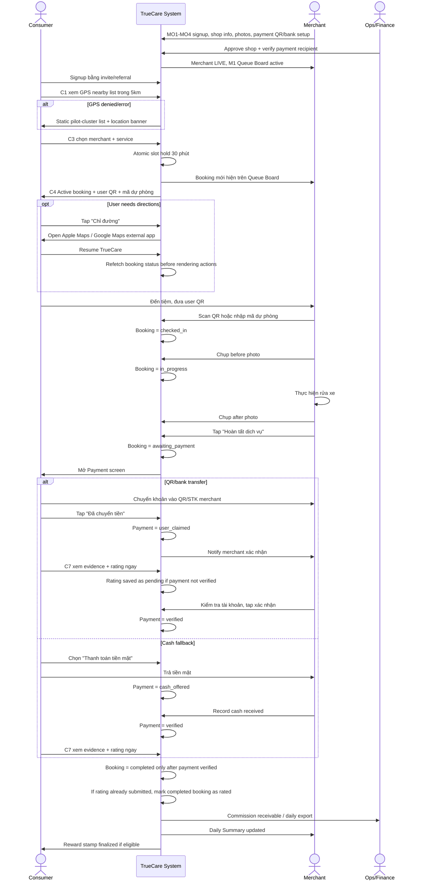
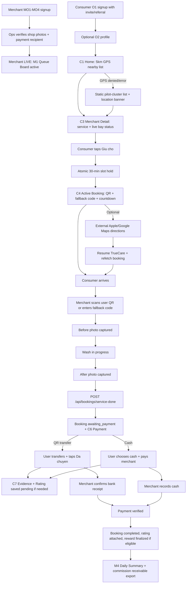

# 09 — Product Requirements Document (PRD)

## TrueCare SaaS Platform — P0 Final Edition

> **Version:** P0-Final (9-Day Sprint) | **Updated:** 2026-05-09 | **Status:** Approved

---

## Table of Contents

### P0 — Product & Scope
1. [Executive Summary](#1-executive-summary)
2. [Problem Statement](#2-problem-statement)
3. [Product Vision](#3-product-vision)
4. [User Personas](#4-user-personas)
5. [Product Scope](#5-product-scope)
   - 7 Modules (Catalog, Booking, Payment, Evidence, Discovery, Onboarding, Promo Codes)
   - 5 Human-Operated Workflows
   - NOT in P0 Scope
   - Reward System (Stamp + Voucher + C10/C11/C12)

### P0 — Consumer (12 screens)
6. [Functional Requirements — Consumer](#6-functional-requirements--consumer)
   - O1/O2 Onboarding (Signup + Optional Profile)
   - C1 Home (GPS Nearby List)
   - C3 Merchant Detail (Services + Bay Grid + Promo Code + External Maps)
   - C4 Active Booking (Countdown + QR + Promo Discount + Maps Resume)
   - C5 Check-in (User QR Display)
   - C6 Payment (QR Bank Transfer + Cash)
   - C7 Evidence + Rating (Before/After Photos)
   - C9 Profile (Vehicle + History + Language)
   - C10/C11/C12 Reward (Center + Redeem + Celebration)

### P0 — Merchant (6 screens)
7. [Functional Requirements — Merchant](#7-functional-requirements--merchant)
   - MO1-MO4 Onboarding (Signup → Shop Info → Photos + Service Config → Payment Setup)
   - M1 Queue Board (Live Bay Grid + Booking List + Promo Tags)
   - M2 Slot Management (Bay Toggle + Service Config + Gio Vang Config)
   - M4 Daily Summary (Revenue + CSV Export)
   - Check-in & Service Flow (QR Scan + Before/After Photos)

### P0 — Architecture & Data
8. [Payment Architecture & VETC Loyalty Deferral](#8-payment-architecture--vetc-loyalty-deferral)
9. [Authentication & Identity](#9-authentication--identity)
10. [Booking & Slot Management](#10-booking--slot-management)
11. [Evidence & Trust System](#11-evidence--trust-system)
12. [Recommendation Engine](#12-recommendation-engine)
14. [Real-Time Synchronization](#14-real-time-synchronization)
15. [Data Model](#15-data-model)
16. [API Specification](#16-api-specification)
17. [Integration Points](#17-integration-points)
18. [Non-Functional Requirements](#18-non-functional-requirements)

### P0 — Delivery
19. [User Flows](#19-user-flows)
20. [Success Metrics](#20-success-metrics)
21. [Implementation Plan](#21-implementation-plan)
22. [Risks & Mitigations](#22-risks--mitigations)
23. [P0 Screen Manifest](#23-p0-screen-manifest)
24. [Appendices](#24-appendices)

### P1+ — Deferred
13. [VETC Integration Strategy (Future-Proof)](#13-vetc-integration-strategy-future-proof)
   - Also: C2 Map View, In-App Navigation, FCM Push, Auto-Arrival, Automated eKYC — see §5.3

---

## 1. Executive Summary

**TrueCare** is Vietnam's first intelligence-led car-care network, using route context to recommend car-care actions and route users to trusted merchants. The P0-Final product spec is deliberately scoped to prove the booking, trust, evidence, and merchant operating loop before committing to deep VETC integration.

**Strategic caveat:** P0-Final is a de-risked standalone pilot variant. It can validate whether users and merchants complete a QR/GPS-based wash booking loop, but it **does not validate** the funded business proposal's core moat: VETC route intelligence, VETC Wallet/Loyalty utility, VETC app frequency uplift, or VETC-owned zero-CAC distribution. Those must be measured in a follow-up Route Moat Gate before reporting the pilot as proof of the full Tasco/VETC thesis.

### Core Philosophy for P0-Final

> **"Get users booking in under 30 seconds. Worry about identity federation later."**

P0-Final intentionally breaks from the original P0-Full baseline in three critical ways to de-risk the pilot:

1. **Authentication:** Local-first identity (Email/SĐT + Password) replaces VETC OAuth as the primary path. VETC login exists only as a disabled placeholder UI element. This eliminates integration timeline risk and prevents vendor lock-in.
2. **Payment:** QR/Bank Transfer replaces VETC Wallet as the primary payment rail. Cash remains as a zero-commission fallback. VETC Wallet is a labeled placeholder.
3. **Discovery:** GPS-nearby merchant lists replace VETC route-intelligence recommendations. All route-data dependencies (GoongIO routing, weather boost, commute detection) are deferred to P1.

### P0 Pilot Baseline

| Dimension | P0-Final Commitment |
|---|---|
| **Merchants** | 12-20 live curated merchants in 1 route-dense cluster (Hanoi or HCMC) |
| **Users** | 300-800 invite-code-gated early adopters (no VETC ID required) |
| **Screens** | 23 screens/flows (see P0 Screen Manifest) |
| **Productized modules** | 7: Service Catalog/SOP, Booking/Slot Hold/Check-in, Payment Ledger, Photo Evidence, GPS Discovery, Assisted Onboarding, Promo Code System |
| **Human-operated workflows** | 5: Merchant Admissions, Daily Summary/Payout Export, SLA/Network Health, Complaint/Refund Review, Growth/eKYC Review |
| **Build window** | 9 days (all-inclusive sprint) + Weeks 2-4 GTM execution only |
| **Auth provider** | Local-first (JWT), VETC OAuth deferred |
| **Payment primary** | QR/Bank Transfer |
| **Payment fallback** | Cash (0% commission pilot incentive) |
| **Payment deferred** | VETC Wallet (native SDK/webview overlay deferred to P1) |

### One-Line Message

TrueCare turns car care into a trusted, timed, evidence-backed booking — from need to payment in one sealed loop, with booking context preserved even when users open external Maps for directions.

---

## 2. Problem Statement

### 2.1 Current State

| Pain Point | Consumer Impact | Merchant Impact |
|---|---|---|
| No proactive care reminder | Wash when remembered (or forgotten) | Random, unpredictable demand |
| No trust in service quality | Gamble on unknown shops | Cannot prove quality to attract customers |
| Unknown wait time | Drive by, see queue, drive away | Lose walk-by business |
| Manual discovery | Google Maps shows POI, no booking, no pricing, no guarantee | No digital presence, no demand generation |
| Cash-dependent, no records | No payment trail, no complaint recourse | No revenue visibility, opaque tax position |
| Fragmented journey | Switch between Maps, Phone, Wallet apps | Manage queue by memory and paper |

### 2.2 Why This Must Be Solved Now

- **Car-care market is 95% SME-fragmented** with zero digital operating layer — a vacant control point.
- **No competitor** has both demand-side context AND merchant operating infrastructure. Grab/Be have users but no vehicle context. Google Maps has POI but no booking/payment/SLA.
- **Regulatory tailwind:** Decree 119/2024 (mandatory ETC), Decree 123/2020 + 70/2025 (e-invoice), Decree 13/2023 (personal data protection).
- **Timing window:** 12-18 months before major competitors react.

### 2.3 The Switching Trigger

For the primary consumer persona (Anh Tuan, 35, sales manager, Hanoi, 30-50km daily driving):

> "If TrueCare shows me trusted shops near me, holds a slot so I don't gamble on availability, and handles payment — I switch immediately."

---

## 3. Product Vision

### 3.1 Core Experience — Consumer

A user opens TrueCare. The app shows trusted wash shops within 5km, sorted by availability, rating, distance, and service-mode match. The user taps a shop, sees services and live bay status, taps "Giữ chỗ" — slot held for 30 minutes. They may open external Maps for directions, then return to TrueCare. At the shop, the merchant scans the user's QR code, service executes, the user pays by QR bank transfer or cash, taps a binary rating, and leaves while merchant payment verification closes the booking in the background.

**The system handles timing, slot holding, merchant QR check-in, payment state, evidence, and merchant verification. The user makes a small number of conscious decisions: "choose shop," "hold slot," optional "get directions," "pay," and "rate."**

### 3.2 Core Experience — Merchant

A wash shop owner places their phone at the counter. The screen shows a live bay status grid. A booking comes in — bay turns blue. The customer arrives, shows a QR code, the merchant scans it. Bay turns orange. The merchant captures a before-photo, executes the wash, captures an after-photo, taps "Hoàn tất." The customer pays via QR or cash. The merchant confirms receipt. End of day: the merchant glances at the Daily Summary — services done, revenue, payout queued.

**The merchant interacts through glances and two camera taps. Everything else is automatic.**

### 3.3 Platform Principles

1. **No avoidable app-switching for core TrueCare state.** Booking, check-in, evidence, rating, and booking/payment state stay in-app. P0 explicitly allows external Maps for directions and a bank app for QR transfer.
2. **Low-friction, invite-gated onboarding.** Users book within 30 seconds after entering a valid pilot invite/referral code. No OTP, no email verification, no mandatory profiling.
3. **Dual-sided real-time sync.** Consumer and merchant see the same booking state simultaneously.
4. **Evidence is non-negotiable.** Before/after photos with geotag and timestamp are the trust currency.
5. **Vietnamese-first UX.** Default language, diacritic-safe typography, cash fallback, 56px merchant touch targets, tested at 320px width.
6. **Minimal conscious interaction.** User holds a slot and shows their QR; merchant scans the user QR to check in. Merchant camera opens for before/after evidence. Auto-arrival detection is P1, not P0.
7. **No vendor lock-in for the standalone loop.** Authentication and payment function independently of VETC, but the business moat remains VETC-native and requires a later proof gate.

---

## 4. User Personas

### 4.1 Primary Consumer — "Anh Tuan"

| Attribute | Detail |
|---|---|
| Age / Role | 35, Sales/Business Manager, Hanoi |
| Vehicle | Toyota Vios, 30F-88x.xx |
| Daily driving | 30-50km, primarily urban commute |
| Car's role | Professional tool — clean car equals professional image |
| Current wash workflow | Remember manually → drive by known shop → check queue visually → wait or leave → pay cash |
| Time wasted per wash | 20-45 minutes on timing uncertainty |
| Wash frequency | 2-4 times/month |
| Tech comfort | Smartphone-native. Uses bank apps (Vietcombank, Momo). Uses maps. |
| **Switching trigger** | "An app that shows me trusted shops nearby, holds a slot, and handles payment — one tap each." |

### 4.2 Primary Merchant — "Chi Lan"

| Attribute | Detail |
|---|---|
| Age / Role | 42, Owner of 3-bay wash shop, Hanoi |
| Staff | 2-3 workers |
| Daily challenge | Peak hours overloaded (5-7pm), dead hours empty (10am-2pm) |
| Current management | No booking system. Queue by memory. Cash only. No digital records. |
| Tech comfort | Has smartphone, uses Zalo, accepts QR payment. No SaaS experience. |
| Physical context | Hands often wet/dirty. Outdoors. Bright sunlight. Phone at counter. |
| **Switching trigger** | "Someone who brings me customers when my bays are empty and handles payment. I don't want to learn software." |

### 4.3 Secondary — Ops (Tasco Operations Team)

| Attribute | Detail |
|---|---|
| Role | Network health monitoring, SLA enforcement, complaint review, payout reconciliation |
| P0 tools | Supabase SQL views, CSV exports, SLA inbox spreadsheet, runbooks |

---

## 5. Product Scope

### 5.1 P0 Productized Modules (7 modules)

#### M1: Platform Service Templates

Nền tảng định nghĩa 6 service templates. Mỗi merchant chọn template nào để cung cấp, tự đặt giá trong khoảng floor-ceiling, và điều chỉnh thời lượng phù hợp năng lực thực tế. Templates là cơ sở để áp service mode tags; dịch vụ custom (merchant tự tạo) không có tags.

| # | Template | Floor (VND) | Ceiling (VND) | Default Duration | Evidence |
|---|---|---|---|---|---|
| 1 | Rửa ngoài cơ bản (Basic Exterior Wash) | 70,000 | 200,000 | 20-30 min | Before + after exterior |
| 2 | Rửa trong ngoài (Interior + Exterior) | 120,000 | 300,000 | 35-45 min | Before + after exterior + interior |
| 3 | Hút bụi nội thất (Interior Vacuum) | 30,000 | 100,000 | 15-20 min | Interior after |
| 4 | Vệ sinh kính/gương (Glass/Mirror Cleaning) | 15,000 | 60,000 | 10-15 min | After only |
| 5 | Rửa gầm cơ bản (Basic Underbody Wash) | 80,000 | 200,000 | 20-30 min | Before + after lower body |
| 6 | Combo Giờ Vàng (Golden Hour Combo) | ≥70% merchant base | ≤ceiling of service | Merchant-defined | Same as included services |

Mỗi template có SOP checklist song ngữ (Việt + Anh) với pass/fail criteria.

#### M1.1 Service Mode Tags & Persona Matching

Thay vì chỉ phân biệt dịch vụ theo kỹ thuật, P0 hỗ trợ service mode tags để match merchant capability với consumer preference.

##### Service Mode Tags (P0)

| Tag | Mô tả | Consumer Persona | Merchant Requirement | Icon |
|---|---|---|---|---|
| `fast_lane` | Rửa nhanh <20 phút, không chờ | Tài xế dịch vụ, người đi làm giờ cao điểm | Bay trống, nhân viên >=2, không nội thất | lightning bolt |
| `premium_care` | Chất lượng cao, chăm sóc chi tiết | Khối văn phòng, xe sang, chủ xe kỹ tính | SOP checklist đầy đủ, evidence bắt buộc, rating >=4.5 | star |
| `drive_thru` | Không xuống xe, ngồi trong xe chờ | Người đi cùng gia đình, trời nắng/mưa | Có mái che, ghế chờ, điều hòa | car |
| `night_owl` | Mở cửa sau 19h | Người đi làm văn phòng, ca tối | Giờ mở cửa đến >=20h | moon |

##### Tag Assignment Rules

- Merchant tự chọn tags trong onboarding (MO3 Services & Schedule screen).
- Ops reviewer xác nhận tag trong go-live approval. Tag sai = gỡ hoặc cảnh cáo.
- Tối đa 3 tags per merchant trong P0 để tránh spam.
- Tags hiển thị trên merchant detail card (C3) và list view.

##### Tag Quality Enforcement

- Tag `premium_care` yêu cầu evidence coverage >95% và rating >4.5. Nếu drop → auto-remove tag.
- Tag `fast_lane` yêu cầu duration thực tế <25 phút trong 90% bookings. Nếu vi phạm → ops review.
- Tag `drive_thru` yêu cầu merchant có mái che và ghế chờ được xác nhận trong MO3 Shop Photos.

#### M1.2 Merchant Service Configuration

Mỗi merchant tự quản lý danh sách dịch vụ của mình dựa trên service templates của nền tảng. Merchant có thể: chọn template nào muốn cung cấp, tự đặt giá trong khoảng floor-ceiling, điều chỉnh thời lượng, tạm ẩn dịch vụ không khả dụng, và tạo dịch vụ riêng (custom).

**Platform Guardrails:**

| Rule | Mô tả |
|---|---|
| Floor price | Merchant không thể đặt giá thấp hơn floor của template |
| Ceiling price | Merchant không thể đặt giá cao hơn ceiling của template |
| Min services | Mỗi merchant phải cung cấp ít nhất 1 dịch vụ active để được go-live |
| Custom service review | Dịch vụ tự tạo phải qua ops review (ảnh mẫu + mô tả) trước khi hiển thị cho consumer. Status: `pending_review` → ops → `active` / `rejected` |
| Evidence requirement | Kế thừa từ template nếu dùng template; nếu custom thì bắt buộc before+after |
| Service mode tags | Chỉ áp dụng cho dịch vụ từ template, không áp cho custom |
| Price change log | Thay đổi giá post-go-live được ghi vào `price_change_log` table |

**Custom Service Rules:**
- Merchant submits: name, price, duration_min, duration_max, mô tả, ảnh minh hoạ
- Ops reviews trong 24h → approved (hiển thị badge "Đặc biệt" trên C3) hoặc rejected (kèm lý do, merchant có thể sửa và gửi lại)
- Custom service không thuộc template nào → không có service mode tags
- Merchant có thể disable custom service bất kỳ lúc nào (không cần ops review lại)

**Data Model:**

```
ServiceTemplate (platform-owned):
  id, name, floor_price, ceiling_price, duration_min, duration_max,
  evidence_required, sop_checklist_url

MerchantService (per-merchant config):
  id, merchant_id, template_id (nullable for custom), name, price,
  duration_min, duration_max, status ('active' | 'disabled' | 'pending_review' | 'rejected'),
  is_custom, description, photo_url, ops_reviewed_by, ops_reviewed_at,
  created_at, updated_at
```

**Screen Impact:**
- MO3: merchant chọn template + đặt giá/thời lượng + toggle bật/tắt + nút "Thêm dịch vụ riêng"
- M2: tab "Dịch vụ" cho phép chỉnh sửa giá/thời lượng/bật tắt post-go-live
- C3: render từ `GET /api/merchants/:id/services` — hiển thị giá thực tế của merchant đó
- C4: booking lưu `merchant_service_id` (thay vì `service_type` string), giá hiển thị là giá merchant đã đặt

#### M2: Booking, Slot Hold & Check-in

**Slot Hold Flow:**
```
User taps "Giữ chỗ" → Backend performs atomic PostgreSQL UPDATE on slot_capacity
  → If available_bays > 0: bay decremented, hold created, 30-min countdown starts
  → If available_bays = 0: returns SLOT_FULL with alternative merchants
  → Concurrent holds: first write wins, second gets conflict response
```

**Rules:**
- PostgreSQL owns all booking capacity writes. Redis is limited to cache, pub/sub, and worker support.
- Hold duration: 30 minutes.
- Auto-release on expiry with user notification + rebook suggestion.
- Rate limiting: Maximum 3 active holds per user. Maximum 2 holds at the same merchant.
- No-show policy: 1st = warning, 2nd in 30 days = warning, 3rd in 30 days = 50K VND deposit required.
- Deposit + no-show: refund minus 20K VND penalty. Deposit + check-in: deposit deducted from service payment.
- Booking auto-accepts if the bay is open (merchant does not manually approve each booking). Manual override available.

**Check-in:**
- Consumer presents QR code (in-app or screenshot). Merchant scans via in-app camera.
- On successful scan: green check animation, bay status changes to "in-progress."
- Fallback: manual 6-digit code entry if camera fails.
- Auto-arrival detection (P1): when GPS shows user within 50m of merchant + stationary for 30 seconds, auto-open QR scanner.

#### M3: Payment & Reconciliation Ledger

**Payment Methods:**

| Method | Commission | P0 Rule | P1 Plan |
|---|---|---|---|
| **QR/Bank Transfer** | 10% receivable | **PRIMARY**. Merchant displays QR. User scans with bank app. Merchant confirms receipt. TrueCare accrues commission as a merchant receivable because funds move user->merchant. | Keep as fallback |
| **Cash** | 0% (pilot incentive) | Fallback. Recorded by merchant in app. Manual sampling audit. | Keep |
| **VETC Wallet** | 10% | PLACEHOLDER. UI shows "Sắp ra mắt". | Primary in P1 |

**Payment State Machine:**

```
BOOKING_HELD → CHECKED_IN → SERVICE_IN_PROGRESS → AWAITING_PAYMENT
                                                          │
                                                          ▼
                                                  PAYMENT_INITIATED
                                                          │
                              ┌───────────────────────────┼───────────────────────────┐
                              ▼                           ▼                           ▼
                        QR_TRANSFER                   CASH_OFFERED              VETC_WALLET
                              │                           │                     (placeholder)
                              ▼                           ▼                           │
                         USER_CLAIMED          MERCHANT_RECORDS_CASH                │
                              │                           │                           │
                              └───────────────────────────┴───────────────────────────┘
                                                          │
                                                          ▼
                                                  PAYMENT_VERIFIED
                                                          │
                                                          ▼
                                                     COMPLETED
```

**Idempotency:** Every payment transition uses an idempotency key. Duplicate callbacks produce exactly one business result.

**Commission reconciliation:** Manual weekly CSV export by Tasco finance. Fields: merchant_id, period_start, period_end, total_bookings, total_revenue, commission_receivable, commission_status, invoice_id, waived_reason, settled_at, status.

#### M4: Before/After Photo Evidence

**Capture Flow:**
- At check-in: Merchant app auto-opens camera → "Chụp ảnh TRƯỚC rửa" → one-tap capture → geotagged + timestamped → upload queued.
- At service done: Merchant app auto-opens camera → "Chụp ảnh SAU rửa" → one-tap capture → geotagged + timestamped → upload queued; booking remains `awaiting_payment` until payment is verified.
- Both photos visible to consumer on Evidence/Rating screen before rating submission.

**Reliability:**
- Client-side compression to <500KB before upload.
- Presigned S3 upload URLs.
- Local queue for weak/no network — retries when connectivity restores.
- Status: `evidence_pending` if after-photo missing after 30 minutes → merchant prompt + ops quality flag.

**Privacy:** Photos geotagged for service verification. Access restricted to booking owner (consumer), assigned merchant, and ops support.

#### M5: GPS Discovery & Merchant List

**Discovery Logic (GPS-Nearby in P0):**

```
merchant_score = slot_available × quality_rating × distance_weight × mode_match_boost
recommendation_score = merchant_score (sorted desc)
```

- Discovery radius: 5km default for the P0 nearby endpoint; UI can visually emphasize the closest merchants first.
- P0 endpoint: `GET /api/merchants/nearby?lat=&lng=&radius=5000&page=` with a 5km default radius.
- Response includes `lat`, `lng`, `distance_m`, bay count/status, service mode tags, and rating.
- Sorting: Available bays first, then rating, then distance, with service mode tag/persona match as a boost.
- GPS denied/error fallback: show a static pilot-cluster list sorted from the selected launch cluster center; show a banner prompting location access.
- Stale detection: merchant slot not updated >2 hours → hidden from recommendations + ops alert.
- **Giờ Vàng (Golden Hour):** Merchant-defined discount during dead hours. Floor: price cannot drop below 70% of listed base price.

#### M6: Assisted Onboarding & Growth Engine

**Admission Scoring (Rule-Based Qualification):**

```
ADMISSION_SCORE = (
    location_score    * 0.30  // GPS density, area accessibility
  + capacity_score    * 0.25  // Bay count >=2, operating hours
  + tech_readiness    * 0.20  // Camera permission, smartphone
  + completeness      * 0.15  // Required fields filled
  + photo_quality     * 0.10  // Storefront photo (manual review P0)
)

SCORE >= 80 → QUALIFIED PIPELINE (priority ops review; demo mode enabled)
SCORE 50-79 → MANUAL REVIEW (ops triage within 4h working hours)
SCORE < 50  → REJECT OR NURTURE (specific reason + follow-up path)
```

**Multi-Channel Entry Points:**
1. App Store (organic)
2. Referral link (M-to-M) — `truecare.vn/r/{code}`
3. Zalo OA / ZNS landing page (P1)
4. QR code (field demo / parking lot) (P1)
5. Tasco Army referral web form (P1)
6. Insurance Agent referral portal (P1)
7. Content link (TikTok/Facebook) (P1)

**Referral System:**
- Merchant-to-Merchant: In-app share link. Referrer reward: 1 month free commission. Referee incentive: 30-day free trial.
- Consumer-to-Consumer: Post-wash share via Zalo/FB. Both get 20K VND discount on next wash.
- Attribution: `referral_sources` table with first-touch model.

**Growth Metrics (P0):**
- Merchant leads captured: target >=80
- Qualified applications: target >=30
- eKYC/security completion: target >=70% of qualified applications
- COM / CAC: target <500K VND per qualified merchant

**Merchant Verification (P0-Final):**
- MO3: Storefront photo + bay area photo
- P0: Manual ops review (within 24h)
- Before live bookings: ops verifies storefront, owner phone, bank/QR ownership, and one test booking; reviewer, timestamp, and evidence are stored in the approval audit.
- P1: Auto-verify with OCR + image quality check
- Pre-approval access: demo mode only. Merchants cannot receive real bookings until ops approval and payment-recipient verification are complete.

**Merchant Admission State Machine:**
```
LEAD → QUALIFIED_PIPELINE → READINESS_DEMO → OPS_REVIEW → APPROVED → LIVE
LEAD → MANUAL_REVIEW → REJECTED_OR_NURTURE
OPS_REVIEW → REJECTED → APPEAL → OPS_REVIEW
```

#### M7: Promo Code System

Hệ thống mã giảm giá thủ công — ops tạo mã, merchant hoặc nền tảng phân phối, user nhập mã khi đặt lịch. P0 mặc định nền tảng tài trợ chi phí giảm giá để khuyến khích cả merchant lẫn user.

**Discount Types:**
- `percent`: giảm X% (có `max_discount_amount` cap)
- `fixed`: giảm X VND trực tiếp

**Discount Calculation:**
```
discount = type === 'percent' ? min(total * value%, max_discount_amount) : min(value, total)
final_amount = max(total - discount, 0)
```

**Cost Responsibility:** P0 — nền tảng tài trợ toàn bộ discount. Sau P0 có thể cho merchant chọn đồng tài trợ (50-50).

**Distribution Flow (use case chính):**
```
Ops tạo lô 50 mã "MINHANH-WELCOME-XX" (giảm 20%, max 30K, mỗi user 1 lần, merchant_id = Minh Anh)
  → Gửi danh sách mã cho chủ tiệm Minh Anh
  → Chủ tiệm in mã ra sticker / QR code tại quầy
  → KH đến rửa xe truyền thống → chủ tiệm giới thiệu app
  → KH tải app, đăng ký → nhập mã → được giảm giá lần đầu
  → KH quay lại lần sau (có thể không cần mã)
  → Ops track: mã "MINHANH-WELCOME" có X lượt dùng, đưa Y user mới lên app
```

**Luồng hoạt động:**
```
Ops tạo mã (manual DB insert hoặc ops dashboard)
  → Gán mã cho merchant cụ thể hoặc toàn hệ thống (merchant_id = null)
  → Merchant nhận mã, in/QR/share cho khách
  → User mở app → C3 chọn merchant + dịch vụ
  → Trước khi "Giữ chỗ", có ô "Mã giảm giá" (optional)
  → User nhập mã → POST /api/promo-codes/validate
  → Nếu hợp lệ: giá hiển thị cập nhật (giá gốc → giá sau giảm)
  → User giữ chỗ → booking lưu promo_code_id + discount_amount
  → Merchant thấy booking có tag "🎫 Giảm giá" + mã
  → Merchant thực hiện dịch vụ bình thường
  → Sau booking hoàn tất: usage được ghi nhận
```

**Validation Rules (8 cases):**

| Validation | Error (vi) |
|---|---|
| Code not found | "Mã không tồn tại" |
| is_active = false | "Mã chưa được kích hoạt" |
| now > expires_at | "Mã đã hết hạn" |
| used_count >= usage_limit_total | "Mã đã hết lượt sử dụng" |
| User đã dùng mã này (per_user limit) | "Bạn đã sử dụng mã này" |
| merchant_id không match merchant hiện tại | "Mã không áp dụng cho tiệm này" |
| service_template_id không match dịch vụ đã chọn | "Mã chỉ áp cho [service name]" |
| total < min_order_amount | "Đơn tối thiểu Xđ để dùng mã này" |

**Discount Stacking Rules:**

| Combo | Rule |
|---|---|
| Promo Code + Giờ Vàng | Chọn giá trị giảm cao hơn (không cộng dồn) |
| Promo Code + Referral Discount | Cả hai đều áp dụng (target khác nhau) |
| Promo Code + Reward Voucher | Không dùng chung |
| Giờ Vàng + Referral Discount | Không dùng chung (existing rule) |
| Giờ Vàng + Reward Voucher | Không dùng chung (existing rule) |

**Screen Impact:**

| Screen | Thay đổi |
|---|---|
| C3 Merchant Detail | Dưới danh sách dịch vụ, trước nút "Giữ chỗ": ô nhập "Mã giảm giá (nếu có)" + nút "Áp dụng". Validate real-time, hiển thị giá sau giảm |
| C4 Active Booking | Hiển thị dòng "Giảm giá: -XX,XXXđ (mã YYY)" + tổng sau giảm |
| C6 Payment | QR/tiền mặt hiển thị số tiền sau giảm |
| C9 Profile | Mục "Mã giảm giá của tôi" hiển thị các mã user đang có (được merchant tặng), kèm trạng thái |
| M1 Queue Board | Booking dùng mã → tag "🎫 Giảm giá" kèm mã |
| M4 Daily Summary | Dòng "Giảm giá từ mã" trong phần doanh thu |

**Data Model:**
```
PromoCode:
  id, code, discount_type ('percent' | 'fixed'), discount_value, max_discount_amount,
  min_order_amount, merchant_id (nullable = global), service_template_id (nullable = any),
  usage_limit_total, usage_limit_per_user, used_count, is_active, starts_at, expires_at,
  created_by_ops, platform_fundered (default true in P0), created_at

PromoCodeUsage:
  id, promo_code_id, user_id, booking_id, discount_amount, created_at
```

### 5.2 P0 Human-Operated Workflows (5 workflows)

| # | Workflow | Tools | Owner |
|---|---|---|---|
| W1 | Merchant admissions & launch readiness | Rule-based qualification, photo review, 10-item checklist | Ops Lead |
| W2 | Daily summary & payout operations | SQL export → CSV → manual weekly bank transfer | Finance Ops |
| W3 | SLA watch & network health | Supabase views, SLA inbox spreadsheet, stale merchant alerting | Ops Lead |
| W4 | Complaint triage & refund review | 6-category taxonomy, 48h SLA, ops manager escalation | Quality Lead |
| W5 | Growth ops & eKYC review | Multi-channel attribution dashboard, photo review queue, referral reward tracking | Growth Lead |

### 5.3 Explicitly NOT In P0 Scope

- National rollout, 3,000+ merchant points
- Cross-category services (detailing, maintenance, tires, rescue)
- Full Control Tower product (Next.js dashboard)
- Native VETC app embedding (P0 uses deep links placeholder only)
- Automated merchant settlement (manual CSV in P0)
- Automated refund approval without ops review
- Auto-live merchant onboarding without ops approval
- Automated eKYC/OCR verification
- More than 20 live merchants in the pilot
- SEO/content engine, insurance cross-sell
- ML-based scoring (rules-only in P0)
- 7-agent AI system
- Care Score as core P0 feature
- Wash Pass / membership as core P0 feature
- FleetCare B2B module
- IoT bay sensors
- Real-time background location push (uses significant-change GPS only)
- C2 in-app map view with merchant pins
- In-app Google Maps / GoongIO turn-by-turn navigation
- Google Navigation SDK setup, GCP billing, or Navigation SDK API keys
- Quick Book from map marker
- Arrival overlay, auto-arrival detection, voice guidance, and traffic layer
- `navigation_sessions` backend table or navigation telemetry session tracking
- Dark mode, tablet UI, multilingual beyond Vietnamese + English
- Automated admission decisions or auto-live activation
- Custom merchant services auto-approved without ops review
- Merchant self-service promo code creation (ops-only in P0)

### 5.4 P0 Pilot Reward System (Stamp + Voucher)

P0-Final includes a simple stamp/progress reward system to create repeat-booking behavior without adding wallet, campaign, or point reconciliation complexity. This is a **TrueCare pilot reward**, not a VETC Loyalty program.

**Positioning:**
- Reward supports the core loop: book → service done → payment verified → return.
- Reward must not add a new mandatory step for merchant or user.
- Reward is built Day 5 (stamp trigger) + Day 6 (full UI + voucher engine) of Week 1, immediately after payment/rating is stable. Fully tested Day 7. Ready for GTM messaging from Week 2.

**Reward Rule (P0):**
- 1 eligible completed booking = 1 finalized reward stamp.
- Eligible means: before/after evidence captured, user has submitted rating, and merchant has verified QR receipt or recorded cash. User may rate immediately after tapping "Đã chuyển" or choosing cash, but the stamp remains pending until booking status reaches `completed`.
- 5 reward stamps = 1 basic exterior wash voucher (platform-funded pilot reward).
- Reward vouchers are capped by pilot budget and expire after the configured campaign window.
- QR-paid bookings qualify only after merchant confirmation.
- Cash bookings qualify only after merchant cash record + user confirmation; ops should sample-audit cash reward bookings.
- VETC Loyalty profile, VETC point balance, campaign earn/burn, and loyalty reconciliation remain P1 / Route Moat Gate scope.

**Earn Journey:**
```
Book service
  → Check in
  → Service done, booking awaiting payment
  → User taps "Đã chuyển" or chooses cash → User rates / confirms service
  → System shows pending reward progress on C7 / Profile
  → Merchant confirms QR receipt or records cash
  → Booking reaches completed → System finalizes 1 reward stamp
```

**Redemption Journey:**
```
User reaches reward threshold
  → System issues free-wash voucher
  → Voucher appears on Profile and booking flow
  → User applies voucher on a future basic wash booking
  → Merchant sees booking as platform-funded reward
  → Merchant completes service normally
  → System records voucher redeemed after completion
  → Ops/Finance includes reward payout in pilot reconciliation
```

**Reward State Machine:**
```
NO_PROGRESS → STAMP_1 → STAMP_2 → STAMP_3 → STAMP_4
     → STAMP_5_REACHED → VOUCHER_ISSUED
       → VOUCHER_RESERVED → VOUCHER_REDEEMED
                     └──→ VOUCHER_RELEASED / EXPIRED
```

**Merchant Flow:**
- Merchant does not need an extra action to grant reward stamps.
- Merchant only sees reward context when a booking uses an active voucher or discount.
- Merchant still performs the same service completion, payment confirmation, and evidence/rating flow.
- TrueCare/platform funds P0 reward redemptions under a budget cap; merchant revenue should still be recorded for redeemed services.
- Merchant Daily Summary should separate normal revenue from platform-funded reward value so staff do not treat free-wash bookings as unpaid work.

**Ops / Finance Flow:**
- Ops sets pilot campaign rules before launch: reward threshold, eligible service, expiry window, budget cap, and eligible invite cohorts.
- Finance reviews weekly reward exposure: vouchers issued, vouchers reserved, vouchers redeemed, remaining budget, and merchant payout impact.
- If reward budget cap is reached, new stamps can continue but voucher issuance pauses with clear user copy: "Ưu đãi đang tạm hết, sẽ mở lại trong đợt tiếp theo."
- Disputed bookings freeze reward issuance until ops resolves the case.

**Screen Impact:**
- C1 Home: optional compact progress card after first completed booking.
- C3 Merchant Detail: show "Có thể dùng voucher" only when the user has an applicable voucher.
- C4 Active Booking: if voucher applied, show applied reward summary near price/booking status.
- C6 Payment: reward voucher reduces amount only for eligible future booking; do not show point balance or VETC wallet language.
- C7 Evidence + Rating: after user rating/confirmation, show "Đang xác nhận lượt tích thưởng" until payment is verified, then show finalized progress.
- C9 Profile: show simple reward progress and active voucher history.
- C10 Reward Center: dedicated reward progress screen ("Điểm thưởng của bạn").
- C11 Reward Redeem: simple voucher/service redemption screen for eligible rewards.
- C12 Reward Celebration: success modal/screen when the user reaches the free-wash threshold.

**Implementation Notes:**
- Reward is triggered by the existing rating + payment-verification path, not by a standalone "claim reward" button.
- Each booking can produce at most 1 reward stamp. Duplicate payment confirmations, duplicate rating taps, or retry requests must not add extra stamps.
- Voucher reservation happens when the user applies it to a future booking; if the booking expires or is cancelled before check-in, the voucher returns to available.
- Voucher redemption is final only after the rewarded service is completed and confirmed.
- Do not add public reward complexity in P0: no points marketplace, no tiering, no partial point payment, no campaign stacking.
- Reward uses "điểm thưởng" as user-facing copy, but implementation remains stamp/progress + voucher. Do not show transferable point balance, cash value, or VETC point terminology.

**Reward Edge Cases:**

| Case | Handling |
|---|---|
| User rates twice / retries after slow network | Return same reward result; do not add duplicate stamp |
| Merchant confirms payment but user does not rate/confirm | Keep booking completed, but reward stamp remains pending until user confirmation |
| Booking refunded or disputed after stamp issued | Freeze related reward progress or voucher until ops resolution |
| Voucher applied but user no-shows | Release voucher back to user unless no-show policy requires ops review |
| Voucher expires before use | Mark expired; keep historical progress visible in Profile |
| Platform reward budget reached | Pause new voucher issuance; continue showing earned progress and next campaign copy |

#### 5.4.1 Reward Screens

##### Screen C10: Reward Center

**Purpose:** Let users understand progress, active rewards, and past reward activity without entering a complex loyalty wallet.

```
┌─────────────────────────────────────┐
│  Điểm thưởng của bạn                │
│                                     │
│  3/5 lượt rửa hợp lệ                │
│  ███████████░░░░░░░                 │
│  Còn 2 lượt để nhận 1 lần rửa       │
│  ngoài cơ bản miễn phí              │
│                                     │
│  Ưu đãi đang có                     │
│  ┌─────────────────────────────┐   │
│  │ Chưa có voucher khả dụng    │   │
│  │ Hoàn thành thêm 2 lượt nữa  │   │
│  └─────────────────────────────┘   │
│                                     │
│  Lịch sử gần đây                   │
│  ✓ Rửa ngoài cơ bản +1 lượt        │
│  ✓ Rửa trong ngoài +1 lượt         │
│                                     │
│  [ĐẶT LỊCH RỬA TIẾP]               │
└─────────────────────────────────────┘
```

**Rules:**
- Opens from Profile and from the Home reward card.
- Show progress as "lượt tích thưởng", not currency points.
- If voucher exists, primary CTA becomes "Dùng voucher".
- If campaign budget is paused, show progress but replace CTA with "Ưu đãi sẽ mở lại trong đợt tiếp theo".
- Empty state appears before first eligible booking: "Hoàn thành lần rửa đầu tiên để bắt đầu tích thưởng."

##### Screen C11: Reward Redeem

**Purpose:** Let users apply an available reward to a future eligible service.

```
┌─────────────────────────────────────┐
│  Quy đổi thưởng                     │
│                                     │
│  Bạn có 1 voucher rửa ngoài cơ bản  │
│  miễn phí                           │
│                                     │
│  Dùng cho                           │
│  ┌─────────────────────────────┐   │
│  │ Rửa ngoài cơ bản            │   │
│  │ Tối đa 120,000 VND          │   │
│  └─────────────────────────────┘   │
│                                     │
│  Chọn tiệm trong lần đặt tiếp theo │
│                                     │
│  [DÙNG VOUCHER KHI ĐẶT LỊCH]       │
│  [ĐỂ SAU]                          │
└─────────────────────────────────────┘
```

**Rules:**
- User can reach this screen from Reward Center, Home reward card, or booking flow when an active voucher exists.
- P0 redemption supports one simple service: basic exterior wash.
- Voucher can be applied before booking hold is created or during booking confirmation, but redemption is final only after service completion.
- If the selected merchant/service is not eligible, show: "Voucher này chỉ áp dụng cho Rửa ngoài cơ bản tại tiệm tham gia chương trình."
- **Discount stacking rules for vouchers:** Không dùng chung với promo code. Không dùng chung với Giờ Vàng. Không dùng chung với referral discount. (Xem M7 — Discount Stacking Rules để có bảng đầy đủ.)

##### Screen C12: Reward Celebration

**Purpose:** Create a clear moment of achievement when the user reaches the reward threshold.

```
┌─────────────────────────────────────┐
│           Chúc mừng!                │
│                                     │
│  Bạn đã đủ 5/5 lượt rửa hợp lệ      │
│                                     │
│  Bạn nhận được 1 lần Rửa ngoài      │
│  cơ bản miễn phí                    │
│                                     │
│  Hạn dùng: 30 ngày                  │
│                                     │
│  [ĐỔI DỊCH VỤ NGAY]                │
│  [ĐỂ SAU]                           │
└─────────────────────────────────────┘
```

**Rules:**
- Trigger after C7 rating/confirmation when the threshold is reached.
- If the app is offline, show this after reward sync succeeds, not before.
- Primary CTA opens C11 Reward Redeem.
- Secondary CTA returns Home; voucher remains visible in C10 Reward Center and Profile.
- Celebration appears once per issued voucher. Reopening Profile should not replay the modal repeatedly.

---

## 6. Functional Requirements — Consumer

### 6.0 Consumer Onboarding Flow (Zero-Friction, Local-First)

**Design Principles:**
- Local-first: Email OR SĐT + Password. Account created immediately. No verification delay.
- Invite-gated: P0-Final is not open public signup. Consumer and merchant accounts require a valid pilot invite/referral code or manual ops-created invite.
- Optional profiling: Name and vehicle type are skippable entirely.
- VETC placeholder: "Đăng nhập bằng VETC" button exists but is DISABLED with "Sắp có" label.
- Referral-aware: display referrer name + first-booking bonus if arriving via referral link.
- All screens must work offline after initial load (cached assets).

**Onboarding Flow:**
```
O1-Final (Welcome + Quick Signup) → O2-Final (Quick Profile - OPTIONAL) → C1 Home
```

**Entry Paths:**
```
App Store / Direct:
  → O1-Final (signup + invite code) → O2-Final (optional) → Home

Referral link (?ref=CODE):
  → O1-Final (shows "Giảm 20K lần đầu!") → O2-Final → Home
```

#### 6.0.1 Screen O1-Final: Welcome + Quick Signup

```
┌─────────────────────────────────────┐
│         [TrueCare Logo]             │
│                                     │
│   Đặt lịch rửa xe thông minh       │
│   ✓ Gợi ý tiệm gần bạn            │
│   ✓ Giữ chỗ trước, khỏi chờ        │
│   ✓ Thanh toán dễ dàng             │
│                                     │
│   ┌─────────────────────────────┐   │
│   │ Email hoặc Số điện thoại   │   │ ← Single field, accepts either format
│   └─────────────────────────────┘   │
│                                     │
│   ┌─────────────────────────────┐   │
│   │ Mật khẩu (tối thiểu 6 ký tự)│  │
│   └─────────────────────────────┘   │
│                                     │
│   [BẮT ĐẦU SỬ DỤNG]                │ ← Primary CTA, always enabled if fields valid
│                                     │
│   Đã có tài khoản? Đăng nhập      │ ← Secondary link → Login modal
│                                     │
│   ── hoặc ──                        │
│                                     │
│   [Đăng nhập bằng VETC]            │  ← DISABLED, opacity 0.5
│   (Sẽ có sau khi tích hợp)         │  ← Caption below
│                                     │
│   ┌─────────────────────────────┐   │ ← Visible only if referral
│   │ 🎁 Được giới thiệu bởi      │   │
│   │    bạn Nguyen Van A        │   │
│   │ Giảm 20K lần rửa đầu tiên! │   │
│   └─────────────────────────────┘   │
└─────────────────────────────────────┘
```

**Rules:**
- Email OR phone required (at least one). Validation: if contains @, validate email format. If only digits, validate 9-11 digit phone format.
- Valid invite/referral code required unless the account was pre-created by ops.
- Password minimum 6 characters.
- No verification email/OTP sent.
- Account created immediately on tap when validation and invite checks pass. JWT token returned, stored in SecureStore.
- On success: auto-navigate to O2-Final (or Home if profile already exists).
- Error states: network error → retry button; duplicate account → "Tài khoản đã tồn tại, vui lòng đăng nhập" with link; invalid invite → "Mã mời không hợp lệ" with support contact.

**Validation Matrix:**
| Field | Required | Validation | Error Message |
|---|---|---|---|
| Email/SĐT | Yes | Email regex OR 9-11 digits | "Vui lòng nhập email hoặc số điện thoại hợp lệ" |
| Invite code | Yes | Active pilot invite/referral code | "Mã mời không hợp lệ" |
| Password | Yes | >= 6 chars | "Mật khẩu cần ít nhất 6 ký tự" |

#### 6.0.2 Screen O2-Final: Quick Profile (Optional)

```
┌─────────────────────────────────────┐
│  ←  Bước 1/1 (Tùy chọn)           │
├─────────────────────────────────────┤
│                                     │
│  Cho chúng tôi biết thêm về bạn   │
│  (Có thể bỏ qua)                   │
│                                     │
│  Tên của bạn                        │
│  ┌─────────────────────────────┐   │
│  │                             │   │
│  └─────────────────────────────┘   │
│                                     │
│  Loại xe của bạn                    │
│  ┌──────┐ ┌──────┐ ┌──────┐ ┌────┐│
│  │Sedan │ │ SUV  │ │Hatch-│ │Khác││ ← Card selector. Single-select.
│  └──────┘ └──────┘ └──────┘ └────┘│
│                                     │
│  [BỎ QUA]        [HOÀN TẤT]       │
└─────────────────────────────────────┘
```

**Rules:**
- Entirely skippable via "BỎ QUA" button.
- If skipped: User shown as "Khách" + generic avatar in app.
- Vehicle type defaults to "Sedan" if skipped.
- Can complete later in Profile tab (C9).
- If user came from referral, show persistent banner: "Giảm 20K sẽ áp dụng cho lần rửa đầu tiên!"

#### 6.0.3 Consumer Onboarding State Matrix

| Screen | Loading | Error | Validation | Skip/Back |
|---|---|---|---|---|
| O1-Final | "Đang tạo tài khoản..." | Network error → retry; Duplicate → login link; Invalid invite → support contact | Email/SĐT format, invite code, password length | Back hidden |
| O2-Final | N/A | N/A | N/A (all optional) | Back to O1-Final |

### 6.1 Consumer Home Screen (C1)

**Purpose:** Primary discovery surface. Shows nearby merchants based on GPS.

**Layout:**
```
┌─────────────────────────────────────┐
│  TrueCare              [🔔] [👤]   │ ← Header with notification bell + profile shortcut
├─────────────────────────────────────┤
│  Chào [Tên]!                        │
│  Tiệm gần bạn nhất 📍               │
│                                     │
│  ┌─────────────────────────────┐   │
│  │ [🔍 Tìm kiếm tiệm rửa xe]  │   │ ← Search bar (future P1)
│  └─────────────────────────────┘   │
│                                     │
│  [Sedan ▼] [Giá ↑] [Đánh giá]     │ ← Filter chips (future P1)
│                                     │
│  📍 Gần bạn (5km)                   │
│  ┌─────────────────────────────┐   │
│  │ Tiệm Minh Anh ⭐ 4.8        │   │ ← Merchant card
│  │ 📍 1.2km · 🟢 2 bay trống   │   │
│  │ ⚡ Rửa nhanh · 🌙 Giờ tối   │   │ ← Tags
│  │ [Xem chi tiết]              │   │
│  └─────────────────────────────┘   │
│                                     │
│  ┌─────────────────────────────┐   │
│  │ Tiệm Hoàng Gia ⭐ 4.5       │   │
│  │ 📍 1.8km · 🟡 1 bay trống   │   │
│  │ ⭐ Chất lượng cao           │   │
│  │ [Xem chi tiết]              │   │
│  └─────────────────────────────┘   │
└─────────────────────────────────────┘
```

**Rules:**
- GPS permission requested on first Home visit (not during onboarding). Benefits-first rationale: "Cho phép vị trí để TrueCare hiển thị tiệm rửa xe gần bạn nhất."
- Default UI is a list sorted by nearby relevance; C2 map view is not in P0.
- Pull-to-refresh reloads the list with current GPS coordinates; auto-refresh every 60 seconds while screen is focused.
- Loading: skeleton cards (3 shimmer rows).
- Empty state: "Không có tiệm nào trong bán kính 5km."
- Permission and location states:

| State | Behavior |
|---|---|
| Granted | Fetch `/api/merchants/nearby` with current GPS and show nearby merchant list |
| Denied | Show static pilot-cluster list and banner: "Bật vị trí để thấy tiệm gần nhất." |
| Not determined | Show benefit-first permission prompt overlay |
| Error / timeout | Fallback to static pilot-cluster list and log silently |

### 6.2 Consumer Merchant Detail Screen (C3)

**Purpose:** Show merchant info, services, live bay status, and allow booking.

**Layout:**
```
┌─────────────────────────────────────┐
│  ←  Tiệm Minh Anh                  │
├─────────────────────────────────────┤
│  [Ảnh mặt tiền tiệm]               │
│                                     │
│  Tiệm Minh Anh ⭐ 4.8 (120 đánh giá)│
│  📍 123 Nguyễn Trãi, Hà Nội        │
│  ⏰ 06:00 - 21:00                   │
│                                     │
│  ⚡ Rửa nhanh  🌙 Giờ tối          │ ← Tags
│                                     │
│  ┌─────────────────────────────┐   │
│  │ BAY STATUS GRID             │   │
│  │ Bay 1: 🟢 Trống             │   │
│  │ Bay 2: 🔵 Giữ chỗ (14:45)   │   │
│  │ Bay 3: 🟠 Đang rửa          │   │
│  └─────────────────────────────┘   │
│                                     │
│  Dịch vụ của tiệm:                  │
│  ┌─────────────────────────────┐   │
│  │ Rửa ngoài cơ bản            │   │
│  │ 20-30 phút · 100,000đ       │   │
│  │ [Chọn]                      │   │
│  └─────────────────────────────┘   │
│  ┌─────────────────────────────┐   │
│  │ Rửa trong ngoài             │   │
│  │ 35-45 phút · 180,000đ       │   │
│  │ [Chọn]                      │   │
│  └─────────────────────────────┘   │
│  ┌─────────────────────────────┐   │
│  │ 🏷️ Tạo bóng xe             │   │ ← Custom service, "Đặc biệt" badge
│  │ 30-40 phút · 150,000đ       │   │
│  │ [Chọn]                      │   │
│  └─────────────────────────────┘   │
│                                     │
│  ┌─────────────────────────────┐   │
│  │ Mã giảm giá (nếu có)       │   │ ← Promo code input
│  │ [___________] [Áp dụng]    │   │
│  └─────────────────────────────┘   │
│                                     │
│  [📞 Gọi tiệm]  [🗺️ Chỉ đường]    │ ← Secondary actions
└─────────────────────────────────────┘
```

**Rules:**
- Services fetched from `GET /api/merchants/:id/services` (per-merchant config, not global catalog). Mỗi dịch vụ hiển thị giá thực tế merchant đã đặt.
- Custom services (merchant tự tạo, không từ template) hiển thị badge "🏷️ Đặc biệt".
- Tap service → Booking confirmation modal (gửi `merchant_service_id`).
- Bay status updates in real-time (Supabase Realtime or refetch every 10s).
- If all bays full: show "Tất cả các bay đang bận" + suggest nearby merchants.
- **Promo code input:** ô "Mã giảm giá (nếu có)" + nút "Áp dụng". Gọi `POST /api/promo-codes/validate` real-time. Nếu hợp lệ: hiển thị giá gốc bị gạch ngang + giá sau giảm + "Đã áp dụng mã XXX". Nếu không hợp lệ: hiển thị lỗi tương ứng (8 validation cases — xem M7).
- Tap "Chỉ đường" opens external Maps only:
  - iOS: `https://maps.apple.com/?daddr={merchant.lat},{merchant.lng}&dirflg=d`
  - Android: `https://www.google.com/maps/dir/?api=1&destination={merchant.lat},{merchant.lng}&travelmode=driving`
- If Maps cannot open: show merchant address as text + "Sao chép địa chỉ".
- Photos tab (P1): show storefront and bay photos from merchant onboarding.
- Reviews tab (P1): show aggregated ratings.

### 6.3 Consumer Active Booking Screen (C4)

**Purpose:** Show held slot, countdown, merchant info, and check-in action.

**Layout:**
```
┌─────────────────────────────────────┐
│  ←  Lịch hẹn của bạn               │
├─────────────────────────────────────┤
│                                     │
│  ⏳ Giữ chỗ còn: 14:32             │ ← Countdown timer, large, red when <5min
│                                     │
│  Tiệm Minh Anh                      │
│  📍 123 Nguyễn Trãi                │
│  🚗 Rửa ngoài cơ bản               │
│  💰 100,000đ                        │
│  🎫 Giảm giá: -20,000đ (mã WELCOME)│ ← Promo discount line (if applied)
│  Tổng: 80,000đ                      │ ← Total after discount
│                                     │
│  ┌─────────────────────────────┐   │
│  │  [QR CODE - CHECK IN]       │   │ ← Large QR code for merchant scanning
│  │                             │   │
│  │  Mã: TC-4829               │   │ ← Fallback 6-digit code
│  └─────────────────────────────┘   │
│                                     │
│  [Hủy giữ chỗ]                     │ ← Secondary, with confirmation dialog
│                                     │
│  [🗺️ Chỉ đường]                     │ ← Opens map app (Google Maps / Apple Maps)
└─────────────────────────────────────┘
```

**Rules:**
- Countdown: 30 minutes from hold creation. Auto-refreshes every second.
- Booking stores `merchant_service_id` (not hardcoded `service_type` string). Giá hiển thị là giá thực tế merchant đã đặt.
- If promo code applied: hiển thị dòng "Giảm giá: -XX,XXXđ (mã YYY)" + tổng sau giảm. `promo_code_id` và `discount_amount` lưu trong booking.
- Background behavior: visual countdown pauses when app backgrounds, but booking expiry remains based on `expires_at`; expiry is checked on resume.
- Tap "Chỉ đường" opens external Maps using the same C3 deep-link rules. No in-app Navigation SDK or turn-by-turn session is created.
- On app resume from Maps: `useFocusEffect` refetches booking status before rendering current actions.
- On expiry: auto-release slot, show "Giữ chỗ đã hết hạn" + rebook suggestion.
- QR code: generated from booking ID + user ID hash. Merchant scans to check in.
- Cancellation: confirmation dialog → "Bạn có chắc muốn hủy?" → release slot → return to Home.

### 6.4 Consumer Payment Screen (C6-Final)

**Purpose:** Handle payment after service completion.

**Layout:**
```
┌─────────────────────────────────────┐
│  ←  Thanh toán dịch vụ             │
├─────────────────────────────────────┤
│                                     │
│  Rửa ngoài cơ bản                   │
│  Tiệm Minh Anh                      │
│                                     │
│  Tổng cộng: 80,000 VND             │ ← Large, bold (after discount if promo applied)
│                                     │
│  ┌─────────────────────────────┐   │
│  │  📷 [QR CODE NGÂN HÀNG]    │   │ ← Merchant's QR code
│  │                             │   │
│  │  Quét mã để chuyển tiền   │   │
│  └─────────────────────────────┘   │
│                                     │
│  Chủ TK: NGUYEN VAN A              │
│  STK: 1234567890                   │
│  Ngân hàng: Vietcombank            │
│                                     │
│  [Đã chuyển tiền]                  │ ← Primary CTA
│                                     │
│  ── hoặc thanh toán tiền mặt ──   │
│                                     │
│  [Thanh toán tiền mặt]             │
│                                     │
│  ───────────────────────────────   │
│  [VETC Wallet - Sắp ra mắt]        │ ← Disabled, placeholder
└─────────────────────────────────────┘
```

**Rules:**
- QR code: loaded from merchant's `payment_qr_url` (uploaded during MO4 onboarding).
- Bank details: loaded from merchant's `bank_account` fields.
- Total amount: hiển thị `booking.total_amount` (sau khi đã trừ promo discount nếu có).
- "Đã chuyển tiền": sends notification to merchant app. Does NOT auto-confirm (requires merchant verification).
- "Thanh toán tiền mặt": sends cash notification to merchant. Merchant records amount.
- VETC Wallet section: always disabled with "Sắp ra mắt" label. Tapping shows tooltip: "Tính năng sẽ có trong bản cập nhật tới."

### 6.5 Consumer Evidence & Rating Screen (C7)

**Purpose:** Show before/after photos and collect rating.

**Layout:**
```
┌─────────────────────────────────────┐
│  ←  Đánh giá dịch vụ               │
├─────────────────────────────────────┤
│                                     │
│  Ảnh trước & sau:                   │
│  ┌─────────────┐ ┌─────────────┐   │
│  │ [Ảnh trước]│ │ [Ảnh sau]  │   │
│  └─────────────┘ └─────────────┘   │
│                                     │
│  Bạn có hài lòng không?             │
│                                     │
│     👍           👎                │ ← Large binary buttons
│   Hài lòng    Không hài lòng       │
│                                     │
│  Góp ý thêm (không bắt buộc):      │
│  ┌─────────────────────────────┐   │
│  │                             │   │
│  └─────────────────────────────┘   │
│                                     │
│  [GỬI ĐÁNH GIÁ]                    │
└─────────────────────────────────────┘
```

**Rules:**
- Photos are mandatory before rating. If after-photo missing → show "Chờ xác nhận" state.
- Binary rating: 👍 or 👎. No star rating in P0.
- Optional comment text field.
- On submit: update merchant rating aggregate, show "Cảm ơn bạn!" confirmation, navigate to Home.
- Post-wash share (P1): after rating, offer "Chia sẻ — bạn và bạn bè cùng được giảm 20K" with Zalo/FB share buttons.

### 6.6 Consumer Profile Screen (C9)

**Purpose:** Manage profile, view history, language, and VETC linking (placeholder).

**Layout:**
```
┌─────────────────────────────────────┐
│  Hồ sơ của bạn                     │
├─────────────────────────────────────┤
│                                     │
│  [Avatar] [Tên]                     │
│  [SĐT / Email]                      │
│                                     │
│  ───────────────────────────────   │
│                                     │
│  [🚗 Thông tin xe]                  │
│  [📜 Lịch sử đặt lịch]             │
│  [🎫 Mã giảm giá của tôi]          │ ← Active promo codes from merchants
│  [🎁 Mã giới thiệu]                │
│                                     │
│  ───────────────────────────────   │
│                                     │
│  [🔵 Liên kết VETC]                │ ← Disabled, shows "Sắp có"
│  [🌐 Ngôn ngữ: Tiếng Việt]         │
│  [❓ Trợ giúp]                      │
│                                     │
│  [Đăng xuất]                        │
└─────────────────────────────────────┘
```

**Rules:**
- Vehicle info: editable. Pre-filled from O2-Final if provided.
- History: list of past bookings with status, merchant, amount, date.
- **Mã giảm giá của tôi:** danh sách mã user đang có (được merchant/phân phối tặng), hiển thị trạng thái: "Có thể dùng", "Đã dùng", "Hết hạn". Fetch từ `GET /api/promo-codes/user`.
- Language switch: Vietnamese (default) / English.
- VETC link: disabled. Shows "Sắp có" subtitle. Tooltip on tap explains future benefit.
- Logout: clear SecureStore JWT, navigate to O1-Final.

---

## 7. Functional Requirements — Merchant

### 7.1 Merchant Onboarding Flow (Simplified, Ops-Verified)

**Design Principles:**
- No CCCD required. No bank test transfer.
- Storefront/bay photos plus manual recipient verification. Photo-only review is sufficient for demo mode, not for live bookings.
- Ops review within 24h.
- All fields use large touch targets (56px minimum).

**Flow:**
```
MO1-Final (Welcome + Signup) → MO2-Final (Shop Info) → MO3-Final (Photos) → MO4-Final (Payment Setup) → Pending Review
```

#### 7.1.1 Screen MO1-Final: Welcome + Signup

```
┌─────────────────────────────────────┐
│  Quản lý tiệm rửa xe thông minh    │
│  ✓ Nhận khách đặt lịch             │
│  ✓ Quản lý hàng chờ                │
│  ✓ Chụp ảnh trước/sau              │
│                                     │
│  Email hoặc Số điện thoại          │
│  ┌─────────────────────────────┐   │
│  │                             │   │
│  └─────────────────────────────┘   │
│                                     │
│  Mật khẩu                           │
│  ┌─────────────────────────────┐   │
│  │                             │   │
│  └─────────────────────────────┘   │
│                                     │
│  [ĐĂNG KÝ TIỆM]                    │
│                                     │
│  Đã có tài khoản? Đăng nhập      │
└─────────────────────────────────────┘
```

**Rules:**
- Same validation as consumer O1-Final.
- On success: create merchant account with role='merchant_pending', navigate to MO2-Final.

#### 7.1.2 Screen MO2-Final: Shop Info

```
┌─────────────────────────────────────┐
│  ←  Thông tin tiệm của bạn         │
├─────────────────────────────────────┤
│                                     │
│  Tên tiệm *                         │
│  ┌─────────────────────────────┐   │
│  │                             │   │
│  └─────────────────────────────┘   │
│                                     │
│  Địa chỉ *                          │
│  ┌─────────────────────────────┐   │
│  │                             │   │
│  └─────────────────────────────┘   │
│                                     │
│  Số bay rửa *                       │
│  [1] [2] [3] [4] [5+]              │ ← Large touch targets, haptic feedback
│                                     │
│  Giờ mở cửa *                       │
│  Từ: [06:00]  Đến: [21:00]        │ ← Time picker
│                                     │
│  [TIẾP TỤC]                        │ ← Enabled when all required fields valid
└─────────────────────────────────────┘
```

**Rules:**
- Address: free text. P1 will add GPS auto-complete.
- Bay count: determines queue board grid size.
- Operating hours: used for availability calculation.

#### 7.1.3 Screen MO3-Final: Shop Photos

```
┌─────────────────────────────────────┐
│  ←  Xác minh tiệm của bạn          │
├─────────────────────────────────────┤
│                                     │
│  [📷 Chụp ảnh mặt tiền tiệm]      │ ← Opens camera
│  (Cần thấy bảng hiệu)              │
│  [Preview thumbnail if taken]      │
│                                     │
│  [📷 Chụp ảnh khu vực rửa]        │ ← Opens camera
│  (Cần thấy số bay + thiết bị)     │
│  [Preview thumbnail if taken]      │
│                                     │
│  [TIẾP TỤC]                        │ ← Enabled when both photos taken
└─────────────────────────────────────┘
```

**Rules:**
- 2 photos required.
- Camera: use `expo-camera`. Auto-save to temp storage.
- Upload: presigned S3 URL. Compress to <500KB.
- If upload fails: local queue, retry on connectivity.

**Service Configuration (below photos):**

Sau khi chụp ảnh, merchant thấy danh sách 6 service templates + nút "Thêm dịch vụ riêng":

```
┌─────────────────────────────────────┐
│  Dịch vụ của tiệm                   │
│  (Chọn ít nhất 1 dịch vụ)           │
│                                     │
│  ┌─────────────────────────────┐   │
│  │ Rửa ngoài cơ bản     [BẬT] │   │ ← Toggle enable/disable
│  │ Giá: [100,000] VND         │   │ ← Input within [70K-200K]
│  │ TG: [20]-[30] phút         │   │ ← Duration range
│  └─────────────────────────────┘   │
│  ┌─────────────────────────────┐   │
│  │ Rửa trong ngoài      [TẮT] │   │
│  │ Giá: [180,000] VND         │   │
│  │ TG: [35]-[45] phút         │   │
│  └─────────────────────────────┘   │
│  ... (6 templates)                  │
│                                     │
│  [+ Thêm dịch vụ riêng]            │ ← Opens custom service form
│                                     │
│  ┌─────────────────────────────┐   │ ← Custom service (if added)
│  │ 🏷️ Tạo bóng xe    [BẬT]   │   │
│  │ Giá: [150,000] VND         │   │
│  │ TG: [30]-[40] phút         │   │
│  │ Mô tả: Đánh bóng...        │   │
│  │ [📷 Ảnh minh hoạ]          │   │
│  │ Trạng thái: Đang chờ duyệt │   │
│  └─────────────────────────────┘   │
│                                     │
│  [TIẾP TỤC]                        │ ← Enabled when ≥1 service active
└─────────────────────────────────────┘
```

**Rules:**
- Mỗi template có toggle BẬT/TẮT, input giá (validation: floor ≤ price ≤ ceiling), input thời lượng (duration_min, duration_max).
- Min 1 service active để nút "TIẾP TỤC" được enable.
- "Thêm dịch vụ riêng" mở form: tên, giá, duration_min, duration_max, mô tả, ảnh minh hoạ. Submit → gửi `POST /api/merchant-services/custom` → hiển thị badge "Đang chờ duyệt".
- Custom service không có service mode tags.

#### 7.1.4 Screen MO4-Final: Payment Setup

```
┌─────────────────────────────────────┐
│  ←  Thiết lập nhận tiền             │
├─────────────────────────────────────┤
│                                     │
│  Số tài khoản ngân hàng             │
│  ┌─────────────────────────────┐   │
│  │                             │   │
│  └─────────────────────────────┘   │
│                                     │
│  Tên ngân hàng                      │
│  [Chọn ngân hàng ▼]                │ ← Dropdown: Vietcombank, Techcombank, BIDV, etc.
│                                     │
│  Chủ tài khoản                      │
│  ┌─────────────────────────────┐   │
│  │                             │   │
│  └─────────────────────────────┘   │
│                                     │
│  HOẶC upload QR code               │
│  [📷 Chụp QR code ngân hàng]      │ ← Image picker or camera
│  [Preview if uploaded]             │
│                                     │
│  [HOÀN TẤT ĐĂNG KÝ]               │ ← Enabled when (bank info) OR (QR code) present
└─────────────────────────────────────┘
```

**Rules:**
- Bank info OR QR code (at least one).
- No automated test transfer in the app. Ops must verify account/QR ownership manually before go-live.
- QR code image: displayed on consumer payment screen (C6-Final).
- On submit: set merchant status to `pending_review`. Show "Đã gửi, vui lòng chờ xét duyệt trong 24h."

### 7.2 Merchant State Machine (P0-Final)

```
SIGNUP → SHOP_INFO → PHOTOS → PAYMENT_SETUP → PENDING_REVIEW
                                               │
                                               ▼
                                          OPS_REVIEW (24h SLA)
                                               │
                              ┌────────────────┴────────────────┐
                              ▼                                 ▼
                           APPROVED                          REJECTED
                              │                                 │
                              ▼                                 ▼
                    PAYMENT_RECIPIENT_VERIFIED          [Sửa & Gửi lại]
                              │                                 │
                              ▼                                 └──► PAYMENT_SETUP
                            GO_LIVE
```

**State Definitions:**
| State | Description | Consumer Visible | Can Receive Bookings |
|---|---|---|---|
| `pending_info` | Signed up but incomplete | No | No |
| `pending_review` | Info complete, awaiting ops | No | No |
| `rejected` | Ops rejected, pending edits | No | No |
| `approved` | Ops approved shop quality, awaiting payment-recipient verification | No | No |
| `live` | Active merchant | Yes | Yes |
| `suspended` | Ops suspended (violation) | No | No |

**Go-Live Approval Runbook:**
- Confirm storefront and bay photos match the submitted address and service catalog.
- Call the owner phone number and verify the person can operate the merchant account.
- Verify bank account or QR ownership manually; store reviewer, timestamp, proof note, and screenshot/reference.
- Run one test booking from hold → check-in → evidence → QR/cash payment confirmation.
- Only ops can move `approved` to `live`; all go-live actions require an audit log row.

### 7.3 Merchant Queue Board (M1)

**Purpose:** Live dashboard showing bay status and booking queue.

**Layout:**
```
┌─────────────────────────────────────┐
│  TrueCare · Tiệm Minh Anh   12:34  │ ← Always-on header
├─────────────────────────────────────┤
│  Hôm nay: 8 đã xong · 1.2M VND     │ ← Quick stats
├─────────────────────────────────────┤
│  BAY 1     BAY 2     BAY 3         │
│  ┌────┐   ┌────┐   ┌────┐         │
│  │ 🟢 │   │ 🔵 │   │ 🟠 │         │ ← Bay status grid
│  │Trống│   │Giu │   │Đang│         │   Green=available
│  │     │   │14:45│   │rửa │         │   Blue=held
│  └────┘   └────┘   └────┘         │   Orange=in-progress
│                                     │   Gray=done
│  HÀNG CHỜ                           │
│  ┌─────────────────────────────┐   │
│  │ 🚗 Nguyen Van A · 14:30    │   │ ← Upcoming bookings
│  │    Rửa ngoài · Bay 2       │   │
│  │    🎫 Mã WELCOME            │   │ ← Promo tag (if applied)
│  │    [Quét QR để check-in]   │   │
│  └─────────────────────────────┘   │
│                                     │
│  ┌─────────────────────────────┐   │
│  │ 📋 Tran Thi B · 15:00      │   │
│  │    Rửa trong ngoài · Bay 1 │   │
│  └─────────────────────────────┘   │
└─────────────────────────────────────┘
```

**Rules:**
- Screen stays on while docked (never sleeps when plugged in).
- On new booking: wake screen, play distinctive ping, bay turns blue.
- Tap booking → detail view → camera prompt if in check-in or completion state.
- Pull-to-refresh + 30-second auto-refresh via refetch on focus.
- Optimistic UI updates.
- **Ambient mode:** Long-term always-on display may risk OLED burn-in. Recommend LCD tablets or accept ghosting risk.

**State Matrix:**
| State | Display |
|---|---|
| Loading | Skeleton rows (4 shimmer rows) |
| Empty (no bookings) | "Chưa có khách. Bay sẵn sàng!" + bay grid still visible |
| Error | "Không tải được dữ liệu." + retry |
| Partial (some bays, no bookings) | Bay grid visible, empty queue message |

### 7.4 Merchant Slot Management (M2)

**Purpose:** Configure bay availability, Giờ Vàng pricing, and service catalog.

**Layout:**
```
┌─────────────────────────────────────┐
│  ←  Quản lý tiệm                    │
├─────────────────────────────────────┤
│  [Bay] [Dịch vụ] [Giờ Vàng]        │ ← Tab bar
├─────────────────────────────────────┤
│  (Bay tab — existing)               │
│  Giờ hoạt động: 06:00 - 21:00      │
│  [Lịch trống hôm nay]              │
│  ┌─────────────────────────────┐   │
│  │        Bay 1   Bay 2   Bay 3│   │
│  │ 06:00   🟢      🟢      🟢  │   │
│  │ 07:00   🟢      🔴      🟢  │   │ ← Tap to toggle
│  │ 08:00   🟢      🟢      🟢  │   │   Green=open, Red=closed
│  │ ...                         │   │
│  └─────────────────────────────┘   │
│                                     │
│  (Dịch vụ tab — same editor as MO3)│
│                                     │
│  (Giờ Vàng tab)                    │
│  Từ: [10:00] Đến: [14:00]         │
│  Giảm giá: [20]%                   │
│  (Không thấp hơn 70% giá gốc)      │
│                                     │
│  [LƯU THAY ĐỔI]                    │
└─────────────────────────────────────┘
```

**Rules:**
- **Bay tab:** hourly grid per bay, tap to toggle open/closed.
- **Dịch vụ tab:** same editor as MO3 onboarding — bật/tắt template, chỉnh giá/thời lượng, thêm custom service. Post-go-live editable. Custom services hiển thị status badge ("active", "Đang chờ duyệt", "Từ chối"). Thay đổi giá được log vào `price_change_log`.
- **Giờ Vàng tab:** start time, end time, discount %. Floor enforced at >=70% merchant base price.
- Save triggers API call. Toast confirmation: "Đã cập nhật."
- 56px touch targets (vs 48px consumer). Haptic feedback on every tap.

### 7.5 Merchant Daily Summary (M4)

**Purpose:** End-of-day revenue and booking review.

**Layout:**
```
┌─────────────────────────────────────┐
│  ←  Báo cáo hôm nay                │
├─────────────────────────────────────┤
│  [📅 07/05/2026]                    │
│                                     │
│  ┌──────────┐ ┌──────────┐         │
│  │  12      │ │ 1.4M     │         │
│  │  Dịch vụ │ │  Doanh   │         │
│  │  đã xong │ │  thu     │         │
│  └──────────┘ └──────────┘         │
│                                     │
│  💳 QR/CK: 1.2M    💵 Tiền mặt: 200K│
│  🎫 Giảm giá từ mã: -40K            │ ← Promo discount total
│  ⭐ TB Đánh giá: 4.8               │
│                                     │
│  Chi tiết:                          │
│  ┌─────────────────────────────┐   │
│  │ 14:30 · Rửa ngoài · 100K · ✅│   │
│  │ 15:00 · Rửa trong · 180K · ✅│   │
│  │ ...                        │   │
│  └─────────────────────────────┘   │
│                                     │
│  [XUẤT CSV]                        │
└─────────────────────────────────────┘
```

**Rules:**
- Date picker at top (default: today).
- Stats: services completed, total revenue, QR total, cash total, promo discount total, average rating, complaint count.
- Booking list: time, customer, service, amount, method, promo code (if any), status.
- Payout status: pending / processed.
- CSV export: for merchant record-keeping. Includes promo code column.

### 7.6 Merchant Check-in & Service Flow

**Check-in Flow:**
```
Merchant taps booking in Queue Board → Camera opens → Scan user QR
  → Green check animation → Booking = checked_in
  → Camera auto-opens: "Chụp ảnh TRƯỚC rửa"
  → Before photo uploaded/queued → Booking = in_progress
  → Staff executes wash
  → Service done → Camera auto-opens: "Chụp ảnh SAU rửa"
  → After photo uploaded/queued
  → Merchant taps "Hoàn tất dịch vụ" (enabled only after after photo)
  → Booking = awaiting_payment
  → User app shows Payment screen
  → User pays QR/cash
  → Merchant confirms receipt / records cash
  → Payment = verified
  → Booking = completed
```

**Rules:**
- QR scan: in-app camera. Decode booking ID hash. User QR kèm mã 6 chữ số dự phòng (VD: TC-4829).
- Fallback: manual 6-digit code entry nếu camera lỗi.
- Before-photo: mandatory. Cannot proceed without capture.
- After-photo: mandatory. Nút "Hoàn tất" bị disable (greyed out) nếu chưa có after photo.
- Merchant tap "Hoàn tất dịch vụ" chỉ xác nhận service đã xong và trigger payment; thao tác này không đóng booking.
- Booking chỉ chuyển `completed` khi payment được merchant xác nhận hoặc cash được merchant record.
- Evidence upload: queued if network weak. Local retry.

---

## 8. Payment Architecture & VETC Loyalty Deferral

**Section 8 caveat:** In the funded VETC-native baseline, Section 8 previously defined VETC Loyalty profile, point redemption, campaign earn, and reconciliation behavior. P0-Final intentionally defers those flows. This section is now the QR-first payment architecture plus the explicit VETC Loyalty deferral contract. Do not infer that P0-Final validates VETC Loyalty utility, point burn/earn behavior, campaign ROI, or Wallet reconciliation.

**Standardized P0 booking/payment flow after conflict resolution:**



**Implementation guardrail:** `completed` is reserved for closed, payment-verified bookings. Service done without merchant payment verification is `awaiting_payment`, not `completed`.

### 8.1 Payment Method Comparison

| Method | Commission | Settlement Speed | Consumer UX | Merchant UX | P0 Status |
|---|---|---|---|---|---|
| **QR/Bank Transfer** | 10% receivable | Instant (user→merchant) | Scan QR, open bank app, transfer | Check bank app, tap confirm | **PRIMARY** |
| **Cash** | 0% | Instant | Hand cash | Record in app, confirm | Fallback |
| **VETC Wallet** | 10% | T+1 (if platform-mediated) | One-tap in-app | Auto-settled | Placeholder |

### 8.2 Why QR/Bank Transfer is Primary in P0

1. **Zero integration risk:** No dependency on VETC SDK timeline or API stability.
2. **User familiarity:** Vietnamese users regularly scan QR codes for bank transfers (VietQR standard).
3. **Merchant acceptance:** Merchants already display VietQR codes at counters.
4. **Instant settlement:** Money moves directly from user to merchant. No platform float required.
5. **Low fraud surface:** Merchant must manually confirm receipt, creating a natural verification step.
6. **Future-proof:** When VETC Wallet launches, QR remains as a fallback. No user behavior to unlearn.

**Control limitation:** Because QR funds settle directly from user to merchant, TrueCare does not control money movement in P0-Final. Commission is an accrued merchant receivable, not an automatically deducted platform take rate.

### 8.3 Payment State Machine (Detailed)

```
BOOKING_HELD → CHECKED_IN → SERVICE_IN_PROGRESS → AWAITING_PAYMENT
                                                          │
                                                          ▼
                                                  PAYMENT_INITIATED
                                                          │
                              ┌───────────────────────────┼───────────────────────────┐
                              ▼                           ▼                           ▼
                        QR_TRANSFER                   CASH_OFFERED              VETC_WALLET
                              │                           │                     (placeholder)
                              ▼                           ▼                           │
                         USER_CLAIMED          MERCHANT_RECORDS_CASH                │
                              │                           │                           │
                              └───────────────────────────┴───────────────────────────┘
                                                          │
                                                          ▼
                                                  PAYMENT_VERIFIED
                                                          │
                                                          ▼
                                                     COMPLETED
```

**State Definitions:**
| State | Description | Actor | Next State |
|---|---|---|---|
| `BOOKING_HELD` | Slot held, countdown active | System | `CHECKED_IN` (on QR scan) or `EXPIRED` |
| `CHECKED_IN` | User arrived, service started | Merchant (scan) | `SERVICE_IN_PROGRESS` |
| `SERVICE_IN_PROGRESS` | Wash executing | Merchant | `AWAITING_PAYMENT` after after-photo and service done event |
| `AWAITING_PAYMENT` | Service evidence complete, payment screen ready, booking not completed | Merchant + System | `PAYMENT_INITIATED` |
| `PAYMENT_INITIATED` | Payment screen shown to user | System | Method selection |
| `QR_TRANSFER` | User selected QR/bank | User | `USER_CLAIMED` |
| `CASH_OFFERED` | User selected cash; merchant records received cash as an event, not a separate terminal booking state | User + Merchant | `PAYMENT_VERIFIED` |
| `VETC_WALLET` | User selected VETC (disabled) | User | N/A (blocked) |
| `USER_CLAIMED` | User claims QR/bank transfer is done; booking remains `awaiting_payment` | User | `PAYMENT_VERIFIED` or `DISPUTED` |
| `PAYMENT_VERIFIED` | Merchant has confirmed QR receipt or recorded cash | Merchant | `COMPLETED` |
| `COMPLETED` | Final booking close state after payment verified | System | `RATED` if rating not already submitted |

**State ownership:**
- `AWAITING_PAYMENT` is a booking state.
- `PAYMENT_INITIATED`, `USER_CLAIMED`, `CASH_OFFERED`, `VERIFIED`, `FAILED`, and `DISPUTED` are payment states. Merchant cash recording is the event that moves `cash_offered` to `verified`.
- Do not use a service-completed terminal booking status in P0-Final. If the service is done before payment verification, describe it as a service done event and keep `booking.status = awaiting_payment`.

### 8.4 QR Payment Detailed Flow

**Step 1: Service Complete**
- Merchant taps "Hoàn tất dịch vụ" after after-photo capture.
- Backend updates `booking.status = awaiting_payment`.
- Backend creates or opens the payment flow with `payment.status = initiated`.
- In-app notification sent to user: "Xe đã xong! Vui lòng thanh toán."
- User app auto-navigates to Payment screen (C6-Final).

**Step 2: User Payment Screen**
- Display merchant's QR code (large, centered).
- Display bank account details (STK, Chủ TK, Tên NH).
- Display total amount.
- Primary CTA: "Đã chuyển tiền".
- Secondary CTA: "Thanh toán tiền mặt".
- Tertiary (disabled): "VETC Wallet — Sắp ra mắt".

**Step 3: User Action — Bank Transfer**
- User scans QR code with their bank app (Vietcombank, Techcombank, Momo, etc.).
- User completes transfer.
- User returns to TrueCare, taps "Đã chuyển tiền."
- Backend creates or updates `payment_record` with `payment.status = user_claimed`.
- Booking remains `awaiting_payment` until merchant verification.
- Merchant app receives notification: "Khách đã thanh toán. Vui lòng xác nhận."
- User app chuyển ngay sang màn hình Rating (C7) — không chờ merchant confirm.

**Step 4: User Rating (Xảy ra song song với merchant xác nhận)**
- User xem before/after photos trên C7.
- User chọn 👍 (Hài lòng) hoặc 👎 (Không hài lòng), kèm comment tùy chọn.
- User gửi rating → "Cảm ơn bạn!" → Hoàn tất phía user → Quay về Home.
- Nếu rating tạo pending reward progress, C7/Profile hiển thị "Đang xác nhận lượt tích thưởng" cho tới khi merchant payment verification hoàn tất. C12 Celebration chỉ hiện khi finalized stamps đạt threshold.

**Step 5: Merchant Confirmation (Chạy background, không block user)**
- Merchant kiểm tra tài khoản ngân hàng, xác nhận đã nhận tiền.
- Merchant mở TrueCare, thấy thông báo "Khách đã thanh toán".
- Merchant taps "Xác nhận đã nhận tiền."
- Backend updates `payment.status = verified` and stores `merchant_confirmed_at`.
- Booking status → `COMPLETED`.
- Commission receivable accrues at this point.

**Step 6: User Action — Cash**
- User taps "Thanh toán tiền mặt."
- Backend creates `payment_record` with `payment.status = cash_offered`.
- Merchant app receives notification: "Khách chọn thanh toán tiền mặt."
- User hands cash to merchant.
- Merchant records amount in app: "Đã nhận [Số tiền]đ tiền mặt."
- Backend updates `payment.status = verified`.
- Booking status → `COMPLETED`.
- User chuyển sang C7 Rating ngay.

### 8.5 Idempotency & Duplicate Protection

Every payment transition uses an `idempotency_key` (UUID generated client-side, stored server-side for 24h).

```
Client generates idempotency_key → sends with payment action
Server checks: key exists?
  → YES: return cached response (200 OK with previous result)
  → NO: process action, store key → result mapping, return response
```

This prevents:
- Double charges if user taps "Đã chuyển" twice.
- Double merchant confirmation if merchant taps confirm twice.
- Duplicate booking holds from retry logic.

### 8.6 Edge Cases & Resolution

| Case | Handling | Actor | Time Limit |
|---|---|---|---|
| User taps "Đã chuyển" but merchant didn't receive | Merchant taps "Chưa nhận được" → User must retry or use cash | Merchant + User | N/A |
| Merchant forgets to confirm | Auto-reminder notification sau 5 phút. User đã hoàn tất rating, không bị block. Escalate ops sau 15 phút nếu merchant vẫn không confirm. | System | 15 min |
| User wants to pay cash after tapping "Đã chuyển" | Allow switch to cash. Cancel previous `user_claimed` record. | User | N/A |
| Wrong amount transferred | User must transfer difference. Or ops processes manual refund. | Ops | Manual |
| Network failure during payment | Local queue. Retry on connectivity. | System | 24h |
| Merchant rejects cash (e.g., no change) | User must use QR. Merchant can set "Không nhận tiền mặt" in settings (P1). | Merchant | N/A |

### 8.7 Commission Receivables & Reconciliation

**Commission Calculation:**
- QR/Bank Transfer: 10% of service amount, recorded as a merchant receivable at `PAYMENT_VERIFIED`.
- Cash: 0% (pilot incentive).
- Commission is not deducted from user-to-merchant transfers in P0-Final.

**Receivable Workflow:**
- Weekly (every Monday for previous week).
- Manual CSV export by Finance Ops.
- Fields: merchant_id, period_start, period_end, total_bookings, total_revenue, commission_receivable, commission_status, invoice_id, waived_reason, settled_at, dispute_status.
- Finance issues a weekly commission statement to the merchant.
- Merchant pays/settles receivable manually, or Finance records a pilot waiver with reason.
- Random audit compares TrueCare booking records against merchant QR/cash confirmations.

**Receivable State Machine:**
```
ACCRUED → EXPORTED → INVOICED → SETTLED
                         │
                         ├─► WAIVED
                         └─► DISPUTED → RESOLVED
```

### 8.8 VETC Wallet & Loyalty Deferral

**P0-Final behavior:**
- VETC Wallet is visible only as a disabled "Sắp ra mắt" payment option.
- VETC Loyalty profile, point redemption, campaign earn, and loyalty reconciliation are not active in P0-Final.
- No P0-Final success metric may count loyalty redemption rate, campaign cost, wallet GMV, or VETC point earn/burn.

**Follow-up gate before VETC-native pilot claims:**
- VETC Identity contract: user ref, vehicle ref, consent, link/unlink, session ownership.
- VETC Wallet contract: payment initiation, callbacks, timeout/retry states, refund semantics, reconciliation export.
- VETC Loyalty contract: profile/tier, point value/expiry, quote/reserve/commit/release, reversal, campaign budget, reconciliation.
- Finance and Legal sign-off for displaying loyalty balance, applying points, campaign funding, and refund/reversal behavior.

---

## 9. Authentication & Identity

### 9.1 Authentication Architecture (Local-First)

**Principle:** TrueCare operates a fully independent identity system. VETC integration is an additive profile enrichment, never a gate.

**Auth Flow:**
```
[Signup] Email/SĐT + Password + Invite Code → Server validates invite
   → Hash password (bcrypt) → Create User
   → Mark invite consumed → Return JWT (HS256, 7-day expiry) → Store in SecureStore

[Login] Email/SĐT + Password → Server validates → Return JWT → Store in SecureStore

[Session] Every API call includes Authorization: Bearer <JWT>
   → Server verifies signature + expiry
   → If expired: return 401 → Client redirects to Login
```

### 9.2 Auth Requirements Matrix

| Feature | P0-Final | P1 | P2 |
|---|---|---|---|
| Signup | Invite code + Email/SĐT + Password | + VETC OAuth | + Apple/Google Sign-In |
| Login | Email/SĐT + Password | + VETC, + Biometric | + Social |
| Password reset | Manual support reset | Email/SMS reset | Self-service |
| Session | JWT 7 days | JWT + Refresh token | + Device management |
| Logout | Clear SecureStore token | Server-side invalidate | Revoke all sessions |
| Role | `consumer`, `merchant_pending`, `merchant_live`, `ops` | + `admin` | + `franchise` |

### 9.3 Security Measures

- **Password hashing:** bcrypt with cost factor 10.
- **JWT:** HS256 algorithm, 7-day expiry, issued by backend.
- **Storage:** SecureStore in P0-Final. AsyncStorage is not acceptable for JWTs once booking, payment, or evidence data exists.
- **Pilot access:** Signup requires a valid invite/referral code. Open public signup is deferred until fraud, support, and password-recovery paths are hardened.
- **Rate limiting:** 5 login attempts per 15 minutes per IP. 3 signup attempts per hour per device.
- **Device tracking:** Store `device_id` (expo-device) on signup for fraud detection.
- **Sensitive data:** No CCCD, no bank passwords, no VETC tokens stored in P0.

### 9.4 Fraud Prevention

| Risk | Mitigation |
|---|---|
| Fake consumer accounts | Invite-code gating + device ID tracking + max 3 accounts/device |
| Fake merchant accounts | Photo verification + ops review + payment-recipient verification + test booking |
| Multiple bookings to block slots | Max 3 active holds/user, max 2 holds/merchant |
| No-shows | Track count. Require 50K deposit after 2nd no-show in 30 days. |
| Merchant fraud (fake payment confirm) | User complaint + ops review + evidence photos |
| Payment amount manipulation | Amount fixed at booking time. Merchant cannot alter. |

### 9.5 VETC Integration Placeholder (Non-Blocking)

**Current State:** VETC login button exists in UI but is DISABLED.

**UI Behavior:**
- Button opacity: 0.5.
- Label: "Đăng nhập bằng VETC (Sắp có)."
- On tap: show tooltip/bottom sheet: "Tính năng sẽ có trong bản cập nhật tới. Bạn có thể sử dụng tài khoản hiện tại."

**Data Model Preparation:**
- `User` table includes `vetc_id?: string` (nullable).
- `User.auth_provider`: `'local' | 'vetc'`.
- All screens that assumed `vetcId` always exists must handle `null` gracefully.

**Migration Path (P1):**
1. Enable VETC OAuth button.
2. Allow existing local users to **link** VETC identity (not replace).
3. On link: populate `vetc_id`, enrich profile with vehicle data.
4. VETC Wallet becomes primary payment option for linked users.

---

## 10. Booking & Slot Management

### 10.1 Slot Hold Mechanism

**Atomic Hold Flow:**
```sql
BEGIN;
  UPDATE slot_capacity
  SET status = 'held',
      held_by_user_id = $1,
      held_at = NOW(),
      expires_at = NOW() + INTERVAL '30 minutes'
  WHERE merchant_id = $2
    AND bay_number = $3
    AND status = 'available';

  IF FOUND THEN
    INSERT INTO bookings (user_id, merchant_id, bay_number, status, held_at, expires_at)
    VALUES ($1, $2, $3, 'held', NOW(), NOW() + INTERVAL '30 minutes');
    RETURN 'SUCCESS';
  ELSE
    RETURN 'SLOT_FULL';
  END IF;
COMMIT;
```

**Rules:**
- All booking capacity writes go through PostgreSQL. No Redis for writes.
- First atomic UPDATE wins. Second concurrent request gets `SLOT_FULL`.
- `expires_at` is exactly 30 minutes from `held_at`.
- On expiry: cron job releases slot, updates booking to `expired`, sends notification.

### 10.2 Booking State Machine

```
CREATED (hold attempt)
   │
   ├─► HELD (success) ──► CHECKED_IN ──► IN_PROGRESS ──► AWAITING_PAYMENT ──► COMPLETED ──► RATED
   │       │                  │               │                  │
   │       │                  │               │                  └─► PAYMENT_DISPUTED
   │       │                  │               │
   │       │                  │               └─► CANCELLED (merchant)
   │       │                  │
   │       │                  └─► NO_SHOW (expired without check-in)
   │       │
   │       └─► EXPIRED (auto-release)
   │
   └─► SLOT_FULL (failure)
```

**Enforcement Gates:**
- `CHECKED_IN → IN_PROGRESS`: Chỉ chuyển khi before photo đã được capture và upload queued/succeeded.
- `IN_PROGRESS → AWAITING_PAYMENT`: Chỉ chuyển khi after photo đã được capture và upload queued/succeeded, sau đó merchant taps "Hoàn tất dịch vụ." Nút này bị disable nếu chưa có after photo.
- `AWAITING_PAYMENT → COMPLETED`: Chỉ chuyển khi payment được merchant xác nhận hoặc cash được merchant record.
- `COMPLETED → RATED`: canonical closed-booking view. User có thể submit rating ngay sau khi tap "Đã chuyển" hoặc chọn cash; khi đó rating được lưu dạng pending/attached to booking, nhưng booking vẫn chưa `completed` cho tới khi merchant payment verification chạy xong. Nếu rating đã tồn tại, hệ thống chỉ đánh dấu completed booking as rated sau `PAYMENT_VERIFIED`, không yêu cầu user rate lại.

### 10.3 Rate Limiting & Abuse Prevention

| Limit | Value | Rationale |
|---|---|---|
| Max active holds per user | 3 | Prevents slot hoarding |
| Max holds per merchant per user | 2 | Prevents blocking single merchant |
| Hold duration | 30 minutes | Validated in pilot |
| Min time between holds | 5 minutes | Prevents bot spam |
| No-show window | 30 days | Rolling window for penalty |
| Deposit trigger | 3rd no-show | 50K VND deposit required |

---

## 11. Evidence & Trust System

### 11.1 Photo Evidence Requirements

**Mandatory Photos:**
1. **Before-photo:** Taken at check-in. Shows vehicle state before wash.
2. **After-photo:** Taken at service completion. Shows vehicle state after wash.

**Photo Metadata:**
- Timestamp (server-generated on upload).
- Geotag (GPS coordinates at capture time).
- Booking ID (watermark overlay).
- Merchant ID.

**Quality Standards:**
- Minimum resolution: 1280x720.
- Maximum file size: 500KB (client-side compression).
- Format: JPEG.
- Must clearly show vehicle (license plate visible if possible).

### 11.2 Upload Reliability

```
Capture → Compress → Save to local cache → Attempt upload
   │
   ├─► Upload success → Delete local cache → Update booking status
   │
   └─► Upload fail → Keep in local cache → Background retry every 30s
                          │
                          └─► Max retries: 10 → Flag for manual ops review
```

### 11.3 Privacy & Access Control

| Actor | Access Level |
|---|---|
| Booking owner (consumer) | View before + after photos |
| Assigned merchant | View + capture photos |
| Ops support | View (for complaint review only) |
| Other users | None |

---

## 12. Recommendation Engine

### 12.1 GPS Discovery Algorithm (P0)

```
INPUT: user_lat, user_lng, radius_km=5, preferred_service_modes?

merchants = SELECT * FROM merchants
  WHERE status = 'live'
    AND ST_DWithin(location, ST_MakePoint(user_lng, user_lat)::geography, radius_km * 1000)
  ORDER BY (
    (available_bays > 0 ? 1000 : 0) +
    (rating_average * 100) +
    (1 / (distance_km + 0.1) * 50) +
    (service_mode_match ? 100 : 0)
  ) DESC

RETURN merchants with lat, lng, distance_m, bay count/status, service tags, rating
```

**Sorting Priority:**
1. Available bays (merchants with open bays rank highest).
2. Quality rating (higher rated merchants rank higher).
3. Distance (closer merchants rank higher).
4. Service mode / persona tag match (boost, not a hard filter).

If GPS permission is denied or GPS lookup times out, C1 uses a static pilot-cluster ordering and does not claim real-time distance ranking.

### 12.2 Stale Merchant Detection

- If merchant slot status not updated in >2 hours: hide from recommendations.
- Send ops alert: "Merchant [Name] stale >2h."
- Merchant must manually refresh or check in to reappear.

---

## 13. VETC Integration Strategy (Future-Proof)

### 13.1 Integration Timeline

| Phase | Trigger | Features |
|---|---|---|
| **P0 (Now)** | None | VETC login disabled placeholder. Data model prepared (`vetc_id` nullable). |
| **P1** | VETC API contract signed | Enable VETC OAuth. Route data integration. Wallet payment primary. Push notifications. |
| **P2** | Wallet SDK production-ready | Native in-app wallet payment. Auto-settlement. Loyalty point redemption. |
| **P3** | Scale funding | Deep VETC embedding. Native app integration. Fleet data. |

### 13.2 Non-Lock-in Architecture

**Critical Design Decision:** All VETC data is treated as **enrichment**, not **source of truth**.

| Data | Source of Truth | VETC Role |
|---|---|---|
| User identity | TrueCare `users` table | Optional enrichment (name, phone) |
| Vehicle info | TrueCare `vehicles` table | Optional auto-fill |
| Payment | TrueCare `payments` table | Optional additional rail |
| Booking state | PostgreSQL | None (VETC is consumer, not system) |
| Route data | TrueCare (P1) | Source for P1 recommendations |

**If VETC integration is delayed or cancelled:** TrueCare continues to function 100% with local auth, QR payments, and GPS discovery.

---

## 14. Real-Time Synchronization

### 14.1 Sync Architecture

**Pattern:** PostgreSQL-owned writes + Supabase Realtime subscriptions.

```
Consumer App          Supabase Realtime          Merchant App
     │                        │                        │
     │─► hold slot ─────────►│                        │
     │                        │─► broadcast update ───►│
     │                        │                        │─► bay turns blue
     │                        │                        │
     │◄─ merchant confirms ──│◄───────────────────────│
     │                        │                        │
```

**Channels:**
- `bookings:merchant_id=*` — booking state changes.
- `slots:merchant_id=*` — bay availability changes.
- `payments:booking_id=*` — payment status changes.

**Fallback:** If Realtime disconnects, refetch on `useFocusEffect` every screen focus.

### 14.2 Conflict Resolution

- **Booking holds:** Database atomic UPDATE is the single source of truth. Realtime is for notification only.
- **Payment status:** Merchant confirmation is the final authority. User "Đã chuyển" is a claim, not confirmation.
- **Slot status:** Merchant manual override (closing a bay) overrides auto-accept logic.

---

## 15. Data Model

### 15.1 Core Entities

#### User
```typescript
interface User {
  id: string;                    // UUID
  email?: string;
  phone?: string;
  password_hash: string;         // bcrypt
  name?: string;
  avatar_url?: string;
  role: 'consumer' | 'merchant' | 'ops';
  auth_provider: 'local' | 'vetc';
  vetc_id?: string;              // Nullable. Populated when linked.
  invite_code_used?: string;
  invite_consumed_at?: Date;
  referral_code?: string;
  referred_by?: string;          // user_id
  created_at: Date;
  updated_at: Date;
}
```

#### Merchant
```typescript
interface Merchant {
  id: string;                    // UUID
  user_id: string;               // FK to users
  name: string;
  address: string;
  latitude: number;
  longitude: number;
  bay_count: number;
  operating_hours_start: string; // "06:00"
  operating_hours_end: string;   // "21:00"
  status: 'pending_info' | 'pending_review' | 'rejected' | 'approved' | 'live' | 'suspended';
  tags: string[];                // ['fast_lane', 'premium_care', 'drive_thru', 'night_owl']
  rating_average: number;        // 0-5
  rating_count: number;
  commission_rate: number;       // 0.10 default
  bank_account_number?: string;
  bank_name?: string;
  bank_account_holder?: string;
  payment_qr_url?: string;       // S3 URL
  payment_recipient_verified: boolean;
  payment_recipient_verified_by?: string; // ops user_id
  payment_recipient_verified_at?: Date;
  go_live_approved_by?: string;  // ops user_id
  go_live_approved_at?: Date;
  test_booking_id?: string;
  storefront_photo_url?: string;
  bay_photo_url?: string;
  admission_score?: number;
  created_at: Date;
  updated_at: Date;
}
```

Discovery API responses may expose `lat`/`lng` as wire aliases for `latitude`/`longitude`, plus computed `distance_m`; `distance_m` is not persisted on `Merchant`.

#### Booking
```typescript
interface Booking {
  id: string;                    // UUID
  user_id: string;
  merchant_id: string;
  bay_number: number;
  merchant_service_id: string;   // FK to merchant_services (replaces hardcoded service_type)
  status:
    | 'held'
    | 'checked_in'
    | 'in_progress'
    | 'awaiting_payment'
    | 'completed'
    | 'expired'
    | 'cancelled'
    | 'no_show'
    | 'payment_disputed';
  held_at: Date;
  expires_at: Date;
  checked_in_at?: Date;
  service_completed_at?: Date;   // Merchant tapped "Hoàn tất dịch vụ"; booking is not completed yet.
  payment_verified_at?: Date;    // Merchant confirmed QR receipt or recorded cash.
  completed_at?: Date;
  total_amount: number;          // VND — after promo discount (if applied)
  promo_code_id?: string;        // FK to promo_codes (nullable)
  discount_amount?: number;      // VND — discount from promo code
  payment_method?: 'qr_transfer' | 'cash' | 'vetc_wallet';
  payment_status?: 'pending' | 'user_claimed' | 'cash_offered' | 'verified' | 'failed' | 'disputed';
  deposit_amount?: number;
  idempotency_key: string;
  created_at: Date;
  updated_at: Date;
}
```

`completed_at` is set only when the booking closes after payment verification; it should equal or follow `payment_verified_at`. Evidence compliance is tracked as a quality classification, not as a separate terminal booking status.

#### Payment
```typescript
interface Payment {
  id: string;
  booking_id: string;
  amount: number;
  method: 'qr_transfer' | 'cash' | 'vetc_wallet';
  status: 'initiated' | 'user_claimed' | 'cash_offered' | 'verified' | 'failed' | 'disputed';
  merchant_confirmed_at?: Date;
  commission_amount: number;
  commission_status: 'not_applicable' | 'accrued' | 'exported' | 'invoiced' | 'settled' | 'waived' | 'disputed';
  invoice_id?: string;
  settled_at?: Date;
  waived_reason?: string;
  dispute_status?: 'none' | 'open' | 'resolved';
  net_amount?: number;           // Only meaningful when platform-mediated settlement exists.
  idempotency_key: string;
  created_at: Date;
}
```

#### Evidence
```typescript
interface Evidence {
  id: string;
  booking_id: string;
  type: 'before' | 'after';
  photo_url: string;
  thumbnail_url: string;
  latitude?: number;
  longitude?: number;
  captured_at: Date;
  uploaded_at?: Date;
  status: 'pending_upload' | 'uploaded' | 'failed';
}
```

#### ServiceTemplate
```typescript
interface ServiceTemplate {
  id: string;
  name: string;                  // e.g. "Rửa ngoài cơ bản"
  floor_price: number;           // VND — merchant cannot price below this
  ceiling_price: number;         // VND — merchant cannot price above this
  duration_min: number;          // minutes
  duration_max: number;          // minutes
  evidence_required: string;     // e.g. "before+after_exterior"
  sop_checklist_url?: string;    // S3 URL to bilingual SOP
  created_at: Date;
}
```

#### MerchantService
```typescript
interface MerchantService {
  id: string;
  merchant_id: string;           // FK to merchants
  template_id?: string;          // FK to service_templates (null = custom)
  name: string;
  price: number;                 // VND — merchant's actual price
  duration_min: number;
  duration_max: number;
  status: 'active' | 'disabled' | 'pending_review' | 'rejected';
  is_custom: boolean;
  description?: string;          // For custom services
  photo_url?: string;            // For custom services — illustration photo
  ops_reviewed_by?: string;      // ops user_id
  ops_reviewed_at?: Date;
  created_at: Date;
  updated_at: Date;
}
```

#### PromoCode
```typescript
interface PromoCode {
  id: string;
  code: string;                  // e.g. "MINHANH-WELCOME-01"
  discount_type: 'percent' | 'fixed';
  discount_value: number;        // percent value (e.g. 20) or fixed amount (e.g. 20000)
  max_discount_amount?: number;  // cap for percent discounts
  min_order_amount?: number;     // minimum booking total to apply
  merchant_id?: string;          // null = global (applies to all merchants)
  service_template_id?: string;  // null = applies to all services
  usage_limit_total: number;
  usage_limit_per_user: number;  // default 1
  used_count: number;
  is_active: boolean;
  starts_at?: Date;
  expires_at?: Date;
  created_by_ops: string;        // ops user_id
  platform_funded: boolean;      // default true in P0
  created_at: Date;
}
```

#### PromoCodeUsage
```typescript
interface PromoCodeUsage {
  id: string;
  promo_code_id: string;
  user_id: string;
  booking_id: string;
  discount_amount: number;       // VND — actual discount applied
  created_at: Date;
}
```

### 15.2 Entity Relationship Diagram

```
User (1) ──► (N) Booking
  │              │
  │              ├──► MerchantService (N)
  │              │       │
  │              │       ▼
  │              │    ServiceTemplate (N)
  │              │
  │              ├──► PromoCode (N) ──► PromoCodeUsage (N)
  │              │
  │              ▼
  │           Merchant (N)
  │              │
  │              ▼
  │           Evidence (N)
  │              │
  │              ▼
  │           Payment (1)
  │
  ▼
Referral (N)
```

---

## 16. API Specification

### 16.1 Authentication Endpoints

```
POST /api/auth/signup
  Body: { email?: string, phone?: string, password: string, invite_code: string, referral_code?: string }
  Response: { user: User, token: string }
  Errors: 400 (invalid input), 403 (invalid invite), 409 (duplicate account)

POST /api/auth/login
  Body: { email_or_phone: string, password: string }
  Response: { user: User, token: string }
  Errors: 401 (invalid credentials)

GET /api/auth/me
  Headers: Authorization: Bearer <token>
  Response: { user: User }
  Errors: 401 (unauthorized)
```

### 16.2 Merchant Endpoints

```
POST /api/merchants/register
  Body: { email?: string, phone?: string, password: string, invite_code: string, name: string, address: string, bay_count: number, operating_hours_start: string, operating_hours_end: string }
  Response: { merchant: Merchant, token: string }

POST /api/merchants/upload-photo
  Body: multipart/form-data { type: 'storefront' | 'bay', image: File }
  Response: { url: string }

POST /api/merchants/payment-setup
  Body: { bank_account_number?: string, bank_name?: string, bank_account_holder?: string, qr_image?: File }
  Response: { merchant: Merchant }

GET /api/merchants/pending
  Headers: Authorization: Bearer <ops_token>
  Response: { merchants: Merchant[] }

POST /api/merchants/:id/approve
  Headers: Authorization: Bearer <ops_token>
  Response: { merchant: Merchant }

POST /api/merchants/:id/verify-payment-recipient
  Headers: Authorization: Bearer <ops_token>
  Body: { verification_note: string, proof_ref?: string, test_booking_id?: string }
  Response: { merchant: Merchant }
```

### 16.3 Discovery Endpoints

```
GET /api/merchants/nearby?lat={number}&lng={number}&radius={number}&page={number}
  Defaults: radius=5000 meters
  Response: {
    merchants: Array<Merchant & {
      lat: number;
      lng: number;
      distance_m: number;
      available_bays: number;
      bay_count: number;
      service_tags: string[];
      rating_average: number;
    }>;
    total: number;
  }
  Sort: available bays, rating, distance, service mode match
  Notes: lat/lng are response aliases for Merchant.latitude/longitude; service_tags mirrors Merchant.tags; distance_m is computed per request.

GET /api/service-templates
  Response: { templates: ServiceTemplate[] }

GET /api/merchants/:id/services
  Response: { services: MerchantService[] }
  Note: Per-merchant service config — enabled services with merchant's actual price and duration.
```

### 16.4 Booking Endpoints

```
POST /api/bookings/hold
  Body: { merchant_id: string, merchant_service_id: string, promo_code?: string, bay_number?: number }
  Response: { booking: Booking }
  Errors: 409 (slot full), 429 (rate limit)

POST /api/bookings/check-in
  Body: { booking_id: string, qr_code?: string, manual_code?: string }
  Response: { booking: Booking }
  Errors: 404 (invalid code), 410 (expired)

POST /api/bookings/service-done
  Body: { booking_id: string }
  Response: { booking: Booking }
  Effect: records merchant "Hoàn tất dịch vụ", requires after-photo, moves booking to awaiting_payment; does not mark booking completed.

POST /api/bookings/cancel
  Body: { booking_id: string }
  Response: { booking: Booking }
```

### 16.5 Payment Endpoints

```
POST /api/payments/initiate
  Body: { booking_id: string, method: 'qr_transfer' | 'cash' }
  Response: { payment: Payment, merchant_details: { bank_info, qr_url } }

POST /api/payments/confirm
  Headers: Authorization: Bearer <merchant_token>
  Body: { payment_id: string }
  Response: { payment: Payment, booking: Booking }

GET /api/ops/commission-receivables
  Headers: Authorization: Bearer <ops_token>
  Response: { receivables: Payment[] }

POST /api/payments/cash-record
  Headers: Authorization: Bearer <merchant_token>
  Body: { payment_id: string, amount: number }
  Response: { payment: Payment }
```

### 16.6 Evidence Endpoints

```
POST /api/evidence/upload-url
  Body: { booking_id: string, type: 'before' | 'after', content_type: string }
  Response: { presigned_url: string, key: string }

POST /api/evidence/confirm-upload
  Body: { booking_id: string, type: 'before' | 'after', key: string, latitude?: number, longitude?: number }
  Response: { evidence: Evidence }
```

### 16.7 Promo Code Endpoints

```
POST /api/promo-codes
  Headers: Authorization: Bearer <ops_token>
  Body: { code: string, discount_type: 'percent' | 'fixed', discount_value: number, max_discount_amount?: number, min_order_amount?: number, merchant_id?: string, service_template_id?: string, usage_limit_total: number, usage_limit_per_user?: number, expires_at?: string }
  Response: { promo_code: PromoCode }

POST /api/promo-codes/validate
  Body: { code: string, merchant_id: string, merchant_service_id: string, total_amount: number }
  Response: { valid: boolean, promo_code?: PromoCode, discount_amount?: number, final_amount?: number, error?: string }
  Errors: See M7 validation rules (8 cases)

GET /api/promo-codes/user
  Headers: Authorization: Bearer <user_token>
  Response: { promo_codes: Array<PromoCode & { used: boolean, used_at?: Date }> }
```

### 16.8 Merchant Service Endpoints

```
POST /api/merchant-services
  Headers: Authorization: Bearer <merchant_token>
  Body: { template_id: string, price: number, duration_min: number, duration_max: number, status: 'active' | 'disabled' }
  Response: { merchant_service: MerchantService }
  Validation: floor_price ≤ price ≤ ceiling_price

PATCH /api/merchant-services/:id
  Headers: Authorization: Bearer <merchant_token>
  Body: { price?: number, duration_min?: number, duration_max?: number, status?: 'active' | 'disabled' }
  Response: { merchant_service: MerchantService }
  Note: Price changes logged in price_change_log

POST /api/merchant-services/custom
  Headers: Authorization: Bearer <merchant_token>
  Body: { name: string, price: number, duration_min: number, duration_max: number, description?: string, photo?: File }
  Response: { merchant_service: MerchantService }  // status = 'pending_review'
  Note: Requires ops review before consumer-visible

POST /api/merchant-services/:id/resubmit
  Headers: Authorization: Bearer <merchant_token>
  Body: { name?: string, price?: number, duration_min?: number, duration_max?: number, description?: string, photo?: File }
  Response: { merchant_service: MerchantService }
  Note: Only for custom services with status = 'rejected'
```

### 16.9 Rating Endpoints

```
POST /api/ratings
  Body: { booking_id: string, rating: 'positive' | 'negative', comment?: string }
  Response: { rating: Rating, merchant: Merchant }
```

---

## 17. Integration Points

### 17.1 External Services

| Service | Purpose | P0 Status | P1 Plan |
|---|---|---|---|
| **Supabase** | PostgreSQL DB, Auth, Realtime, Storage | Active | Continue |
| **S3 / Supabase Storage** | Photo evidence, QR code images | Active | Continue |
| **External Maps deep-link** | Open Apple Maps / Google Maps directions from C3 and C4 | Active | Continue unless in-app navigation is approved |
| **GoongIO distance matrix** | Optional road-distance enhancement for nearby ranking | Optional if API key ready; fallback to Haversine/PostGIS | Enable for routing |
| **GoongIO routing/navigation** | In-app map, route overlay, turn-by-turn navigation | Defer | P1 only after Route Moat Gate planning |
| **VETC Identity** | OAuth, vehicle data, wallet | Placeholder | Primary auth + payment |
| **FCM** | Push notifications | Defer | Enable |
| **VietQR** | QR code generation standard | Active (merchant upload) | Auto-generate from bank info |

### 17.2 VETC Integration Contract (Future)

**When enabled (P1):**
- OAuth 2.0 flow with PKCE.
- Scopes: `profile`, `vehicle`, `wallet_balance`, `loyalty_points`.
- Redirect URI: `truecare://auth/vetc/callback`.
- Refresh token rotation.
- Consent screen: toggleable per data type.

---

## 18. Non-Functional Requirements

### 18.1 Performance

| Metric | Target |
|---|---|
| App cold start | <3 seconds |
| Screen transition | <300ms |
| API response (p95) | <500ms |
| Nearby merchant fetch (p95) | <500ms for 12-20 merchant pilot cluster |
| GPS permission / location timeout | Fallback within 5 seconds |
| Image upload (p95) | <5 seconds |
| QR scan recognition | <2 seconds |
| Countdown accuracy | ±1 second |

### 18.2 Reliability

| Metric | Target |
|---|---|
| Uptime (API) | 99.9% |
| Uptime (merchant dashboard) | 99.5% |
| Photo upload success rate | >99% |
| Booking hold success rate | >99.9% |
| Payment confirmation rate | >99% |
| GPS denied/error fallback | 100% show static pilot-cluster merchant list, no blocking blank state |
| Resume from external Maps | 100% refetch active booking before rendering booking actions |

### 18.3 Security

| Requirement | Implementation |
|---|---|
| Password storage | bcrypt |
| JWT | HS256, 7-day expiry |
| API rate limiting | 100 req/min per IP |
| Photo access | Signed URLs, 15-min expiry |
| Sensitive data | No plaintext storage of CCCD, bank passwords |

### 18.4 Scalability

| Dimension | P0 Capacity | P1 Target |
|---|---|---|
| Concurrent users | 500 | 5,000 |
| Merchants | 20 | 200 |
| Bookings/day | 500 | 5,000 |
| Photos/day | 1,000 | 10,000 |

### 18.5 Accessibility

- Minimum touch target: 48px (consumer), 56px (merchant).
- Color contrast: WCAG AA minimum.
- Screen reader support for all CTAs.
- Tested at 320px width.
- Vietnamese diacritic-safe typography (line-height >= 1.5).

---

## 19. User Flows

### 19.0 GTM-Ready P0 End-to-End Flow



### 19.1 Consumer Happy Path

```
Install app → O1-Final (signup) → O2-Final (skip profile) → C1 Home
  → Tap merchant card → C3 Merchant Detail
  → (Optional) Enter promo code → discount applied → updated price shown
  → Tap service (merchant's configured price) → Confirm booking → C4 Active Booking (countdown + QR + mã 6 số TC-4829)
  → Optional "Chỉ đường" opens Apple Maps / Google Maps → return to TrueCare, booking refetches
  → Drive to merchant → Show QR → Merchant scans → Service starts
  → Service done → C6-Final Payment (scan merchant QR → transfer → tap "Đã chuyển")
  → C7 Rating (👍/👎) → Done
  → (Background) Merchant kiểm tra TK ngân hàng → Xác nhận đã nhận tiền → Booking COMPLETED
```

**Total conscious actions:** 5-6 taps + 1 bank transfer.

### 19.2 Merchant Happy Path

```
Install app → MO1-Final (signup) → MO2-Final (shop info) → MO3-Final (photos)
  → MO4-Final (payment setup) → "Đang chờ xét duyệt"
  → Ops approves (24h) → M1 Queue Board active
  → Booking arrives → Bay turns blue
  → Customer arrives → Show QR → Merchant scans → Camera opens (before-photo) → Wash
  → Wash done → Camera opens (after-photo) → Nút "Hoàn tất" enable
  → Tap "Hoàn tất dịch vụ" → Booking awaiting_payment → Customer pays QR/cash
  → Kiểm tra TK ngân hàng / đếm tiền mặt → Tap "Xác nhận đã nhận tiền" → Booking completed
  → End of day → M4 Daily Summary
```

**Total conscious actions:** 4 taps + 2 photos.

### 19.3 Complaint Flow

```
Consumer opens Profile → Lịch sử đặt lịch → Select booking → "Khiếu nại"
  → Select category (1-6) → Describe issue → Submit
  → Ops receives ticket (48h SLA) → Review evidence → Decision:
     ├─► Approve refund → Booking status: REFUNDED → User notified
     └─► Reject → Booking status: CLOSED → User notified with reason
```

### 19.4 Refund Flow

```
PAID → COMPLAINT_FILED → OPS_REVIEW (48h SLA)
   │
   ├─► REFUND_APPROVED → REFUND_PENDING → REFUNDED
   │
   └─► REFUND_REJECTED → CLOSED
```

---

## 20. Success Metrics

P0-Final metrics are split into two groups. The first group validates the standalone booking/trust loop. The second group is the deferred VETC moat proof required before reporting the pilot as validation of the funded Tasco/VETC business proposal.

### 20.1 Consumer Metrics

| Metric | P0 Target | Measurement |
|---|---|---|
| Onboarding completion rate | >90% | % users who reach Home after O1 |
| Time to first booking | <30 seconds from install | Analytics timer |
| Booking conversion rate | >40% | % Home visits → booking held |
| Check-in success rate | >95% | % bookings → checked in |
| Payment success rate | >98% | % completed → payment verified |
| Rating submission rate | >80% | % completed → rated |
| NPS | >40 | In-app survey |

### 20.2 Merchant Metrics

| Metric | P0 Target | Measurement |
|---|---|---|
| Onboarding completion rate | >70% | % MO1 → MO4 submission |
| Ops approval rate | >60% | % submitted → approved |
| Time to go-live | <48h | % approved within 24h |
| Booking acceptance rate | >95% | % incoming → accepted |
| Evidence capture rate | >90% | % bookings → both photos |
| Daily active merchants | >80% | % live merchants with >0 booking/week |

### 20.3 Business Metrics

| Metric | P0 Target |
|---|---|
| GMV (Gross Merchandise Value) | >50M VND/month |
| Average order value (AOV) | 120K VND |
| Commission receivables accrued | 5M VND/month |
| Commission receivables settled or waived with reason | >95% of accrued receivables |
| Customer acquisition cost (CAC) | <100K VND |
| Merchant acquisition cost | <500K VND |
| Repeat booking rate (30 days) | >30% |
| Churn rate (merchants) | <10%/month |

### 20.4 Deferred VETC Route Moat Gate

These metrics are **not** validated by GPS-only P0-Final. They become required before any IC, board, or funding update claims TrueCare has validated the VETC-native moat.

| Metric | Gate Target | Measurement |
|---|---|---|
| VETC-linked user share | Defined before VETC pilot | Linked VETC users / active P0 users |
| Route-match rate | >50% of VETC-triggered bookings | Bookings where merchant is on/near the user's actual route |
| Route-trigger booking conversion | >3% from VETC-context prompts | Bookings / route-context recommendations shown |
| Wallet share | Policy-defined before launch | VETC Wallet-paid bookings / paid bookings |
| Loyalty redemption rate | Policy-defined before launch | Orders with VETC points applied / eligible orders |
| VETC app frequency uplift | Positive vs control | Sessions per linked VETC user before/after TrueCare exposure |
| Data contract health | >99% fresh within SLA | Route/identity/wallet/loyalty API freshness and error-rate dashboard |

---

## 21. Implementation Plan

### 21.1 Sprint Breakdown (9 Days — All-Inclusive)

> **Revised 2026-05-09:** Extended from 7 to 9 days to accommodate Merchant Service Configuration (M1.2) and Promo Code System (M7). Weeks 2-4 are GTM execution only — zero tech build. Three developers work in parallel: Tech Owner (backend), Founder 1 (consumer), Founder 2 (merchant).

| Day | Theme | Tech Owner (Backend) | Founder 1 (Consumer) | Founder 2 (Merchant) | Gate |
|---|---|---|---|---|---|
| **0** | Scaffolding | DB migration (all 21 tables: 17 + `service_templates` + `merchant_services` + `promo_codes` + `promo_code_usages`). API scaffold (all endpoints return 200 skeleton). S3/Supabase Storage bucket. Supabase Realtime channels. | Review PRD. Setup dev environment. Install native dependencies (D6). `npx expo prebuild`. | Review PRD. Setup dev environment. | G0: DB + API scaffold verified |
| **1** | Auth + Shell | Auth API: signup + invite validation, login, JWT HS256, `/api/auth/me`. Rate limiting. Invite code CRUD. | O1-Final signup. O2-Final optional profile. C9 Profile shell. Route group `(consumer-tabs)` + tab bar. Shared: `Button`, `Input`. | MO1-Final merchant signup. Route group `(merchant-tabs)` + tab bar. Shared: `Card`, `Badge`, `Toast`. `ErrorBoundary` root. | G2: Auth flow E2E |
| **2** | Onboarding + Home | Merchant API: register, upload-photo (presigned S3), payment-setup. Ops review endpoints (approve, verify-payment-recipient). GPS Discovery API: `GET /api/merchants/nearby` with `distance_m`. Service template API: `GET /api/service-templates`. Merchant service API: `POST /api/merchant-services`, `PATCH`, `POST /api/merchant-services/custom`. | C1 Home: merchant list with GPS, pull-to-refresh, skeleton loading, empty state, GPS permission states, static fallback list. C9 Profile complete: vehicle edit, booking history, language, VETC placeholder. | MO2 Shop Info: name, address, bay count (touch targets), operating hours (time picker). MO3 Shop Photos + **Service Configuration**: camera capture + 6 template list with toggle/price/duration + "Thêm dịch vụ riêng" + custom service form. MO4 Payment Setup: bank info OR QR upload. Service mode tags selector (max 3, template services only). | — |
| **3** | Booking Core | Booking API: `POST /bookings/hold` (atomic PG UPDATE, now accepts `merchant_service_id` + optional `promo_code`), cancel, release-expired (cron). Slot capacity management. Realtime sync setup. | C3 Merchant Detail: storefront ảnh, merchant services list with actual prices + custom badge, bay grid real-time (🟢/🔵/🟠), service tags, promo code input + validate + price update, nút "Giữ chỗ", external Maps "Chỉ đường". C4 Active Booking: countdown timer (`useCountdown`), user QR display, 6-digit fallback, cancel + confirm, promo discount line item, Maps handoff resume refetch. | M1 Queue Board: bay grid real-time, booking list with promo tag, tap → camera check-in, never-sleep mode. M2 Slot Management: tab bar [Bay / Dịch vụ / Giờ Vàng], hourly grid toggle, service config editor (post-go-live), Gio Vang config. | G3: Booking + check-in E2E |
| **4** | Check-in + Evidence | Check-in API: QR decode + manual code. Evidence API: presigned upload, confirm-upload. Evidence quality classification logic. Ops fallback endpoints: ops-checkin, ops-upload-evidence. | C5-Final Check-in: QR full-screen display, 6-digit code display, "Đã đến tiệm" button, check-in success animation. | M1 check-in flow: `expo-camera` → scan user QR → green check → auto-open camera for before photo. After service: "Hoàn tất" → after photo. Compress <500KB. Retry queue. 6-digit manual fallback. | G5: Evidence capture + upload |
| **5** | Payment + Rating + Summary | Payment API: initiate (QR/cash), confirm (merchant), cash-record. Payment state machine. Commission receivable calc. Idempotency key. `GET /ops/commission-receivables`. Daily summary aggregate: bookings, revenue, QR/cash split, promo discount total, evidence % per merchant. **Promo Code backend:** `POST /api/promo-codes` (ops create), `POST /api/promo-codes/validate`, `GET /api/promo-codes/user`. | C6-Final Payment: merchant QR display, bank details, total amount (after discount), "Đã chuyển" + in-app merchant notification, "Tiền mặt" flow. VETC Wallet disabled placeholder. `PaymentErrorBoundary`. C7 Evidence + Rating: before/after side-by-side, 👍/👎, optional comment, submit → "Cảm ơn". **Reward progress:** pending after rating, finalized after payment verified. | M4 Daily Summary: date picker, stats cards (services done, revenue, QR total, cash total, promo discount total, avg rating), booking list with detail + promo code column, CSV export. Payment confirmation flow. Cash record flow. | G4: Payment E2E |
| **6** | Promo + Reward Add-ons | **Promo code logic:** validation engine (8 rules), discount calc, usage tracking, stacking enforcement. **Reward backend:** stamp table, voucher issue/reserve/release/expire/redeem. Budget cap check. **Referral backend:** tracking + reward status. **Complaint API:** POST/GET/PATCH. **Data exports:** 12 data room SQL views. **Concierge fallback:** 5 ops endpoints. | **Promo UI:** C3 promo input + validate, C4/C6 discount display, C9 "Mã giảm giá của tôi" list. **Reward UI:** C10 Reward Center, C12 Celebration, C11 Reward Redeem. **Complaint UI:** Profile → History → booking → complaint. **Referral UI:** share link, reward status. | M1/M4 promo tags + summary line. **Service tags enforcement.** **Merchant pipeline ops UI.** **Failure log view.** **Evidence quality review panel.** **Channel tracking dashboard.** **Budget tracker dashboard.** **Reward booking label.** | — |
| **7** | Full QA | Full smoke test all flows. Bug fixes (P0 only). Lint + test pass. Data room export verify. | Consumer full flow test: signup → C1→C3 (with promo)→C4→C5→C6→C7→C9→C10→C11→C12. All error/empty/edge states. Promo code validation edge cases. | Merchant full flow test: MO1→MO4 (with service config)→ops review→M1→check-in→evidence→payment→M4. Service config edit post-go-live. Real device test (iOS + Android). | G6: Go-live approval ready |
| **8** | Feature QA + Edge Cases | **Promo code edge cases:** all 8 validation errors, stacking conflicts, code exhaustion, expiry, per-user limit. **Merchant service edge cases:** price floor/ceiling violation, custom service review flow, disable all services → C3 empty state, post-go-live price change log. | Consumer edge cases: promo + Giờ Vàng (choose higher), promo + referral (both apply), promo + voucher (reject), expired code, wrong merchant code. | Merchant edge cases: custom service rejected → resubmit, service disable mid-booking, M2 tab switching. | — |
| **9** | Demo + Go-Live | Final QA. Demo recording. Deploy production. | Ops go-live: review 1 merchant → verify payment → set live → test booking with merchant service + promo code. | G6: Go-live approval ready. Tag release: `v1.0.0-p0-final`. | G6 finalized |
| | | | | | **G7 deferred:** Security audit + load test post-pilot |

### 21.2 Gating Criteria (G0–G7)

| Gate | Day | Criteria | Sign-off |
|---|---|---|---|
| G0 | Day 0 | DB schema approved, all API endpoints scaffolded (return 200 skeleton), S3 bucket + Realtime channels created | Tech Lead |
| G1 | Day 0 | API contract frozen (Section 16 — all endpoint signatures locked) | Tech Lead |
| G2 | Day 1 | Invite-gated auth flow working E2E (signup + login + token + SecureStore, both consumer and merchant) | Product Lead |
| G3 | Day 3 | Booking hold (atomic PG) + check-in (QR scan + 6-digit fallback) E2E | QA Lead |
| G4 | Day 5 | Payment flow E2E (QR + cash + merchant confirm + commission receivable export) | Finance Lead |
| G5 | Day 4 | Photo evidence capture + upload + quality classification (before + after) | Ops Lead |
| G6 | Day 7 | Merchant onboarding + payment-recipient verification + test booking + go-live approval | Growth Lead |
| G7 | Post-pilot | Security audit + load test (deferred until after GTM campaign; pilot scope 300-800 users + 12-20 merchants does not require load test for go-live) | CTO |

**Post-P0-Final Gate:** Route Moat Gate (Section 20.4) must pass before declaring the funded VETC-native strategy validated.

### 21.3 Critical Path Dependencies

> **Revised for 9-day sprint with 3 parallel developers.** All tasks below run concurrently within each day. No sequential dependency between consumer and merchant tracks.

```
Day 0:     DB schema (21 tables) + All API endpoint scaffolding + S3/Realtime setup
           └─► Blocks: Nothing (pre-work before Day 1)
           
Day 1:     [Tech Owner] Auth backend ─┐
           [Founder 1] Consumer auth UI ─┼─► Auth E2E (G2)
           [Founder 2] Merchant auth UI ─┘
           
Day 2:     [Tech Owner] Merchant API + GPS Discovery + Service Template API + Merchant Service API ─┐
           [Founder 1] C1 Home + C9 Profile complete ─────────────────────────────────────────────┼─► Onboarding + Discovery
           [Founder 2] MO2-4 onboarding + Service config + Tags ───────────────────────────────────┘
           
Day 3:     [Tech Owner] Booking API (+ merchant_service_id + promo_code) + Realtime sync ─┐
           [Founder 1] C3 Detail (+ promo input) + C4 Booking (+ promo line) ─────────────┼─► Booking E2E (G3)
           [Founder 2] M1 Queue Board (+ promo tag) + M2 Slots (+ Services tab) ──────────┘
           
Day 4:     [Tech Owner] Check-in API + Evidence API ─┐
           [Founder 1] C5 Check-in consumer ──────────┼─► Evidence E2E (G5)
           [Founder 2] M1 check-in + photo flow ──────┘
           
Day 5:     [Tech Owner] Payment API + Summary aggregate + Promo Code Backend ─┐
           [Founder 1] C6 Payment (+ discount) + C7 Rating + Reward ──────────┼─► Payment + Promo Backend E2E (G4)
           [Founder 2] M4 Daily Summary (+ promo line) + Payment confirm ─────┘
           
Day 6:     [Tech Owner] Promo validation engine + Reward backend + Complaint API + Data exports ─┐
           [Founder 1] Promo UI (C9 list) + Reward UI (C10/11/12) + Complaint UI + Referral ────┼─► All add-ons
           [Founder 2] Ops dashboards + Tags enforcement + Pipeline + M1/M4 promo tags ──────────┘
           
Day 7:     All 3 devs: Full QA, bug fixes, main flow E2E ─► G6 passed
Day 8:     All 3 devs: Feature QA — promo edge cases, merchant service edge cases, stacking conflicts
Day 9:     Final QA, demo recording, deploy production ─► G6 finalized, v1.0.0-p0-final tagged
```

**Key parallelization rules:**
- Tech Owner never blocks Founder 1 or Founder 2 — backend endpoints are scaffolded Day 0, logic filled same-day.
- Founder 1 (consumer) and Founder 2 (merchant) work on completely separate route groups — zero merge conflicts.
- Shared components (`Button`, `Input`, `Card`, `Badge`, `Toast`, `ErrorBoundary`) are built Day 1 and consumed by both from Day 2.
- `useCountdown` hook is built Day 3 and shared across C4 (consumer) and M1 (merchant).

### 21.4 Engineering Decisions (from P0-Lean Sprint)

> **Source:** `/plan-eng-review` run on 2026-05-07. These decisions are binding for implementation. Where P0-Final differs from the original P0-Lean sprint decision, the P0-Final policy takes precedence.

#### D1 — Scope: Build Both Consumer + Merchant Flows

**Decision:** Build both consumer and merchant onboarding + core flows in Week 1.

**Trade-off accepted:** High regression risk vs. demonstrating full marketplace loop in one sprint. Mitigation: protect Day 7 for integration testing; no new features after Day 5.

#### D2 — Auth: SecureStore (P0-Final Override)

**Decision:** Use SecureStore for JWT, not AsyncStorage. The original P0-Lean sprint accepted AsyncStorage as an acceptable risk for the 1-week sprint; P0-Final requires SecureStore before any booking, payment, or evidence data exists.

**Migration path:** AsyncStorage may be used temporarily in early sprint development, but must be migrated to SecureStore before G3 (booking hold end-to-end).

#### D3 — State Management: Navigation Params + Manual Fetch

**Decision:** No React Query or global cache. Pass booking state via Expo Router params + refetch on screen focus.

**Risk accepted:** Stale booking state when merchant updates from their side. Mitigation: refetch booking status in `useFocusEffect` on every booking-related screen.

#### D4 — Data Model: `vetcId` Optional + `authProvider`

**Decision:** Single `User` type with `vetcId?: string` and `authProvider: 'local' | 'vetc'`.

**Impact:** Update `mobile/src/types/models.ts` and screens that assume `vetcId` always exists (Profile, Home greeting).

#### D5 — Navigation: Route Groups `(consumer-tabs)` / `(merchant-tabs)`

**Decision:** Use Expo Router v5 route groups for complete separation.

**File restructure:**
```
mobile/app/
  (consumer-tabs)/
    _layout.tsx      ← consumer tab bar
    index.tsx        ← Home (was (tabs)/index.tsx)
    map.tsx
    bookings.tsx
    profile.tsx
  (merchant-tabs)/
    _layout.tsx      ← merchant tab bar
    index.tsx        ← Queue Board
    slots.tsx        ← Slot Management
    summary.tsx      ← Daily Summary
  _layout.tsx        ← root layout decides which group to render
```

#### D6 — Native Dependencies: Add All Day 1 + Prebuild Verify

**Dependencies to install immediately:**
```bash
cd mobile
npx expo install expo-secure-store expo-camera expo-image-picker
npm install react-native-qrcode-svg
npx expo prebuild
```

**Smoke test required before Day 2:**
- [ ] `expo-secure-store`: store/retrieve a test key
- [ ] `expo-camera`: open camera preview
- [ ] `expo-image-picker`: pick an image
- [ ] `react-native-qrcode-svg`: render a QR code

#### D7 — Shared Components: Full Component Library

**Decision:** Build `Button`, `Input`, `Card`, `Badge`, `Toast` as shared components consuming `design/tokens/components.ts`.

**Files to create:**
- `mobile/src/components/Button.tsx`
- `mobile/src/components/Input.tsx`
- `mobile/src/components/Card.tsx`
- `mobile/src/components/Badge.tsx`
- `mobile/src/components/Toast.tsx`

#### D8 — Error Boundaries: Root + Payment Screen

**Files to create:**
- `mobile/src/components/ErrorBoundary.tsx` (root)
- `mobile/src/components/PaymentErrorBoundary.tsx` (payment/QR isolation)

#### D9 — Tests: Jest + RNTL + Tests for All New Screens

**Decision:** Setup Jest and React Native Testing Library; write tests for every new screen.

**Files to create:**
- `mobile/jest.config.js`
- `mobile/src/components/__tests__/Button.test.tsx`
- `mobile/src/components/__tests__/Input.test.tsx`
- `mobile/app/(consumer-tabs)/__tests__/index.test.tsx`
- `mobile/app/(consumer-tabs)/__tests__/profile.test.tsx`
- `mobile/app/(merchant-tabs)/__tests__/index.test.tsx`

**Critical path test coverage:**
- Consumer signup (email + password)
- Consumer signup (phone + password)
- Booking hold (success + slot full)
- Payment QR flow (user scan → transfer → merchant confirm)
- Payment cash flow
- Merchant onboarding state transitions

#### D10 — Countdown Timer: `useCountdown` Hook

**File to create:** `mobile/src/hooks/useCountdown.ts`

**Requirements:**
- `AppState` pause/resume when app backgrounds
- Auto-cleanup on unmount
- Auto-refetch booking status when countdown expires
- Reusable across consumer and merchant screens

#### D11 — Day 0: Full API + DB Scaffolding (New — 7-Day Sprint)

**Decision:** All database tables (17 entities), all API endpoints (Section 16 + 5 concierge fallback endpoints), S3/Supabase Storage bucket, and Supabase Realtime channels must be created on Day 0 before any UI code begins.

**Rationale:** This prevents backend from becoming a bottleneck. Founders 1 and 2 can build every screen against real (skeleton) endpoints from Day 1. Business logic fills in same-day, but the contract is frozen.

**DB tables to create Day 0:** `users`, `merchants`, `services`, `bookings`, `slot_capacity`, `payments`, `evidence`, `ratings`, `referrals`, `complaints`, `failure_log`, `budget_items`, `channel_sources`, `invite_codes`, `reward_stamps`, `reward_vouchers`, `merchant_pipeline_log`, `feedback_log`

**Concierge fallback endpoints (additional to Section 16):**
- `POST /api/bookings/ops-create` — Ops tạo booking thay user
- `POST /api/bookings/:id/ops-checkin` — Ops check-in thủ công
- `POST /api/evidence/ops-upload` — Ops upload ảnh evidence
- `POST /api/payments/:id/ops-confirm` — Ops xác nhận payment
- `POST /api/users/ops-create` — Ops tạo user account

#### D12 — Three-Developer Parallel Work (New — 7-Day Sprint)

**Decision:** Three developers work in completely separate code areas to eliminate merge conflicts and maximize velocity.

**Partition:**
- **Tech Owner:** 100% backend (`/api/` routes, `/services/`, DB migrations, Supabase config). No UI code.
- **Founder 1:** 100% consumer UI (`app/(consumer-tabs)/*`, `app/onboarding/consumer-*`, consumer screens C3-C12). No backend or merchant code.
- **Founder 2:** 100% merchant UI (`app/(merchant-tabs)/*`, `app/onboarding/merchant-*`, ops dashboards). No backend or consumer code.

**Shared code (negotiated):**
- `mobile/src/components/` — shared components. Founder 1 leads `Button`/`Input`; Founder 2 leads `Card`/`Badge`/`Toast`/`ErrorBoundary`. Both consume all.
- `mobile/src/hooks/useCountdown.ts` — built Day 3 by Founder 1, consumed by Founder 2 same day.
- `mobile/src/types/models.ts` — owned by Tech Owner, consumed by both.

#### D13 — G7 Deferred (New — 7-Day Sprint)

**Decision:** Security audit + load test (G7) is deferred to post-pilot. The P0 pilot scope (300-800 invited users, 12-20 merchants, 5-person core team) does not require a formal load test before go-live.

**Pre-requisites met in Week 1:**
- bcrypt password hashing (cost factor 10)
- JWT HS256 with 7-day expiry in SecureStore
- API rate limiting (100 req/min per IP)
- Input validation on all endpoints
- No plaintext storage of sensitive data
- Invite-code gating on signup

**Post-pilot G7 scope:** OWASP Top 10 audit, 500+ concurrent user load test, dependency supply chain scan, penetration test.

#### D14 — All-In Scope: Zero Features Deferred (New — 7-Day Sprint)

**Decision:** No feature is deferred beyond the 9-day sprint. All 23 screens (Section 23), all 7 modules (Section 5.1), reward system (Section 5.4), complaint flow (Section 19.3), referral system (Section 5.1 M6), service mode tags (Section 5.1 M1.1), promo code system (Section 5.1 M7), merchant service configuration (Section 5.1 M1.2), data room exports, and evidence wall export are built and tested by end of Day 9.

**Implication:** Weeks 2-4 are exclusively GTM execution. No code is written, no features are added, no bugs are fixed (unless they are P0 blockers discovered during GTM operations). The tech team shifts to ops support during GTM weeks.

### 21.5 Reward Add-On Roadmap (Week 1 Day 5-7)

> **Revised 2026-05-08:** Reward is no longer a multi-week add-on. It is built within Week 1 immediately after payment/rating works (Day 5 trigger + Day 6 UI + Day 7 test). This enables reward messaging from Week 2 GTM launch.

| Phase | Timing | Goal | Deliverables |
|---|---|---|---|
| **Stamp trigger** | Day 5 | Track pending stamp after rating | Create pending reward progress after user submits rating (user rates ngay sau khi tap "Đã chuyển" hoặc chọn cash, không chờ merchant confirm). Finalize the stamp only when booking reaches `completed`. Prevent duplicates via idempotency. Show pending/finalized progress on C7 success state and C9 Profile. |
| **Reward UI** | Day 6 | Full reward screens | Build C10 Reward Center (progress N/5, active voucher list, history). Build C12 Celebration (threshold reached modal, "Đổi ngay"/"Để sau"). Build C11 Reward Redeem (eligible service selector, no stack with Gio Vang/referral, budget cap awareness). |
| **Voucher engine** | Day 6 | Issue, reserve, release, redeem | Backend: stamp threshold → auto-issue basic wash voucher. Voucher reserve on booking hold, release on expire/cancel, redeem on completion. Budget cap: pause issuance at limit with user copy "Ưu đãi đang tạm hết". |
| **Merchant/Ops readiness** | Day 6 | Reward booking label + review panel | Show "Platform-funded reward" label in M1 Queue Board and M4 Daily Summary. Ops dashboard: issued, reserved, redeemed, expired vouchers. |
| **GTM message** | Day 7 (ready for Week 2 launch) | Campaign copy | "Rửa 5 lần, tặng 1 lần rửa cơ bản" for invite/referral cohorts. Brief merchants with counter script. |
| **Optimize / Cut** | Post-pilot | Evaluate reward ROI | Measure repeat booking, redemption rate, budget burn, merchant friction, fraud signals. Decision: continue as P1 investment or sunset. |

**Build Order (compressed):**
1. Day 5: Add pending reward trigger once C7 rating submits; finalize on payment verification / booking completed.
2. Day 6: Build C10, C12, C11 screens + voucher engine + ops dashboard.
3. Day 7: Test full reward E2E: paid wash → stamp → threshold → voucher → redeem → merchant sees platform-funded label.

### 21.6 Code Review Findings

Code-level issues identified during P0-Lean engineering review. Items marked [P1] are blocking for the sprint; [P2] should be addressed during polish.

#### [P1] `PaymentMethod` enum missing `qr_transfer`

**Location:** `mobile/src/types/models.ts:16`

**Issue:** `PaymentMethod` only has `'vetc_wallet' | 'cash'`. P0-Final makes QR transfer the primary payment method.

**Fix:** Add `'qr_transfer'` to enum before Day 4.

#### [P1] Missing Native Dependencies

**Location:** `mobile/package.json`

**Issue:** 4 critical native modules not installed.

**Fix:** Install and prebuild on Day 1 (see D6).

#### [P2] No API Interceptors or 401 Handler

**Location:** `mobile/src/services/api.ts`

**Issue:** No request/response interceptors, retry logic, or 401 handler.

**Fix:** Create `fetchWithAuth` wrapper in `mobile/src/services/api.ts` (~30 lines) that attaches `Authorization: Bearer <token>` header and redirects to login on 401.

#### [P2] Stale Booking State Without Global Cache

**Issue:** Manual fetch per screen means merchant-side updates don't propagate to consumer screens in real time.

**Mitigation:** Refetch booking status in `useFocusEffect` on every booking-related screen (accepted per D3).

#### [P2] Design Tokens Without Component Consumers

**Location:** `mobile/src/design/tokens/components.ts`

**Issue:** Rich token system exists but no React components consume them. Screens manually reconstruct styles.

**Fix:** See D7 — build shared component library.

#### [P2] Dead Code in Home Screen

**Location:** `mobile/app/(tabs)/index.tsx:393`

**Issue:** `pressed: { opacity: 0.94, transform: [{ scale: 0.99 }] }` defined but never used; `pressedSmall` is used instead.

**Fix:** Remove dead style during Day 2 consumer screen refactor.

#### [P2] Hardcoded Demo Data in Locale Files

**Location:** `mobile/src/i18n/locales/vi.json`, `en.json`

**Issue:** Strings like `"customerName": "Anh Tuấn"` and `"vetcId": "VETC ID: VE-2024-XXXX"` are hardcoded.

**Fix:** Replace with interpolation keys (`{{name}}`, `{{vetcId}}`) when connecting to real auth state.

### 21.7 SDLC Checklist (9-Day All-Inclusive Sprint)

> **Revised 2026-05-09:** Extended to 9 days. Added merchant service configuration (M1.2) and promo code system (M7). Checklist items partitioned by developer for parallel execution.

#### Day 0 — DB + API Scaffolding (Tech Owner only)

**DB Migration — All 21 Tables:**
- [ ] `users` (id, email, phone, password_hash, name, avatar_url, role, auth_provider, vetc_id, invite_code_used, referral_code, referred_by)
- [ ] `merchants` (id, user_id, name, address, lat, lng, bay_count, operating_hours, status, tags, rating_avg, rating_count, commission_rate, bank_* fields, payment_qr_url, payment_recipient_verified, go_live_approved_by, storefront_photo_url, bay_photo_url, admission_score, max_bookings_per_day, pipeline_status)
- [ ] `service_templates` (id, name, floor_price, ceiling_price, duration_min, duration_max, evidence_required, sop_checklist_url) — 6 platform templates
- [ ] `merchant_services` (id, merchant_id, template_id, name, price, duration_min, duration_max, status, is_custom, description, photo_url, ops_reviewed_by, ops_reviewed_at, created_at, updated_at)
- [ ] `bookings` (id, user_id, merchant_id, bay_number, merchant_service_id, promo_code_id, discount_amount, status, held_at, expires_at, checked_in_at, service_completed_at, payment_verified_at, completed_at, total_amount, payment_method, payment_status, deposit_amount, idempotency_key, ops_fallback_used)
- [ ] `slot_capacity` (merchant_id, bay_number, time_slot, status, held_by_user_id, held_at, expires_at)
- [ ] `payments` (id, booking_id, amount, method, status, merchant_confirmed_at, commission_amount, commission_status, invoice_id, settled_at, waived_reason, dispute_status, net_amount, idempotency_key, ops_confirmed)
- [ ] `evidence` (id, booking_id, type, photo_url, thumbnail_url, lat, lng, captured_at, uploaded_at, status, quality)
- [ ] `ratings` (id, booking_id, user_id, merchant_id, rating, comment)
- [ ] `referrals` (id, referrer_id, referee_id, type, code, status, reward_status, created_at)
- [ ] `complaints` (id, booking_id, user_id, merchant_id, category, description, evidence_refs, decision, compensation, owner, sla_due, closed_at)
- [ ] `failure_log` (id, booking_id, merchant_id, error_code, description, detected_at, resolved_at, resolution)
- [ ] `budget_items` (id, category, cap_amount, spent_amount, description)
- [ ] `channel_sources` (id, source_code, type, location, contact_person, placed_at, impressions_est, scan_count, lead_count, booking_count, completed_booking_count)
- [ ] `invite_codes` (id, code, source, max_uses, used_count, created_by, created_at)
- [ ] `reward_stamps` (id, user_id, booking_id, earned_at, campaign_id)
- [ ] `reward_vouchers` (id, user_id, stamp_threshold_reached_at, service_type, status, issued_at, expires_at, reserved_booking_id, redeemed_booking_id)
- [ ] `merchant_pipeline_log` (id, merchant_id, from_status, to_status, changed_by, changed_at, notes)
- [ ] `feedback_log` (id, booking_id, user_id, call_time, answers_json, notes, called_by)
- [ ] `promo_codes` (id, code, discount_type, discount_value, max_discount_amount, min_order_amount, merchant_id, service_template_id, usage_limit_total, usage_limit_per_user, used_count, is_active, starts_at, expires_at, created_by_ops, platform_funded, created_at)
- [ ] `promo_code_usages` (id, promo_code_id, user_id, booking_id, discount_amount, created_at)
- [ ] `price_change_log` (id, merchant_service_id, old_price, new_price, changed_at)

**API Scaffolding — All Endpoints (return `{ status: "ok", data: null }` skeleton):**
- [ ] `POST /api/auth/signup`, `POST /api/auth/login`, `GET /api/auth/me`
- [ ] `POST /api/merchants/register`, `POST /api/merchants/upload-photo`, `POST /api/merchants/payment-setup`, `GET /api/merchants/pending`, `POST /api/merchants/:id/approve`, `POST /api/merchants/:id/verify-payment-recipient`
- [ ] `GET /api/merchants/nearby`, `GET /api/service-templates`, `GET /api/merchants/:id/services`, `GET /api/merchants/:id`
- [ ] `POST /api/bookings/hold`, `POST /api/bookings/check-in`, `POST /api/bookings/service-done`, `POST /api/bookings/cancel`
- [ ] `GET /api/service-templates`, `GET /api/merchants/:id/services`, `POST /api/merchant-services`, `PATCH /api/merchant-services/:id`, `POST /api/merchant-services/custom`, `POST /api/merchant-services/:id/resubmit`
- [ ] `POST /api/promo-codes`, `POST /api/promo-codes/validate`, `GET /api/promo-codes/user`
- [ ] `POST /api/payments/initiate`, `POST /api/payments/confirm`, `POST /api/payments/cash-record`, `GET /api/ops/commission-receivables`
- [ ] `POST /api/evidence/upload-url`, `POST /api/evidence/confirm-upload`
- [ ] `POST /api/ratings`
- [ ] `POST /api/complaints`, `GET /api/complaints`, `PATCH /api/complaints/:id`
- [ ] `POST /api/bookings/ops-create`, `POST /api/bookings/:id/ops-checkin`, `POST /api/evidence/ops-upload`, `POST /api/payments/:id/ops-confirm`, `POST /api/users/ops-create`
- [ ] `GET /api/metrics/export`, `GET /api/evidence/export`, `GET /api/data-room/:section`

**Infrastructure:**
- [ ] Supabase Storage bucket created (`evidence`, `merchant-qr`, `storefront-photos`)
- [ ] Supabase Realtime channels configured (`bookings:merchant_id=*`, `slots:merchant_id=*`, `payments:booking_id=*`)
- [ ] S3 presigned URL config complete
- [ ] Environment variables set: `SUPABASE_URL`, `SUPABASE_ANON_KEY`, `JWT_SECRET`, `S3_BUCKET`, `EXPO_PUBLIC_API_URL`
- [ ] Verify `npm run lint` passes

**G0 Gate:** All endpoints return valid JSON skeleton. All tables exist in Supabase.

#### Day 1 — Auth + Navigation Shell

**Tech Owner (Backend):**
- [ ] Implement signup logic: validate invite code, hash password (bcrypt cost 10), create user, consume invite, return JWT
- [ ] Implement login logic: verify password, return JWT (HS256, 7-day expiry)
- [ ] Implement `/api/auth/me`: return user from JWT
- [ ] Rate limiting: 5 login/15min/IP, 3 signup/hour/device
- [ ] Invite code CRUD for ops (create, list, disable)
- [ ] Write API tests for auth flow

**Founder 1 (Consumer UI):**
- [ ] Create `AuthProvider` with SecureStore JWT persistence
- [ ] Create `fetchWithAuth` wrapper: attach `Authorization: Bearer <token>`, redirect to login on 401
- [ ] Update `User` type: `vetcId?: string`, `authProvider: 'local' | 'vetc'`
- [ ] Add `qr_transfer` to `PaymentMethod` enum
- [ ] Build `Button` component (size variants, disabled, loading)
- [ ] Build `Input` component (label, error, phone/email validation)
- [ ] Build O1-Final: Welcome + Email/SĐT field + Password field + Invite code field + "BẮT ĐẦU SỬ DỤNG" + Login link
- [ ] Build O2-Final: Name field + Vehicle selector (Sedan/SUV/Hatchback/Khác) + "BỎ QUA" + "HOÀN TẤT"
- [ ] Build C9 Profile: avatar + name + vehicle info + booking history + language + VETC placeholder (disabled) + logout
- [ ] Restructure routes: `app/(tabs)/` → `app/(consumer-tabs)/` with tab bar (Home, Map, Bookings, Profile)
- [ ] Write tests: O1-Final signup, O2-Final skip, C9 logout

**Founder 2 (Merchant UI):**
- [ ] Build `Card` component (shadow, radius, padding variants)
- [ ] Build `Badge` component (status colors)
- [ ] Build `Toast` component (success, error, info)
- [ ] Build `ErrorBoundary` root component (fallback UI, retry button)
- [ ] Build MO1-Final: Welcome + Email/SĐT + Password + "ĐĂNG KÝ TIỆM" + Login link
- [ ] Restructure routes: `app/(merchant-tabs)/` with tab bar (Queue, Slots, Summary)
- [ ] Write tests: MO1-Final signup, ErrorBoundary

**G2 Gate:** Consumer signup → login → SecureStore JWT → redirect Home. Merchant signup → login → redirect Queue Board. Both work on physical device.

#### Day 2 — Onboarding + Home + Profile Complete

**Tech Owner (Backend):**
- [ ] Implement merchant register: validate + create merchant + set `pipeline_status=pending_review`
- [ ] Implement photo upload: generate presigned S3 URL, return key
- [ ] Implement payment setup: store bank info and/or QR URL
- [ ] Implement ops review: GET pending merchants, POST approve (set `approved`), POST verify-payment-recipient (set `live`)
- [ ] Implement GPS discovery: `GET /api/merchants/nearby?lat=&lng=&radius=&page=` (Haversine/PostGIS; optional GoongIO distance matrix; return `distance_m`)
- [ ] Implement service templates: `GET /api/service-templates` (6 platform templates with floor/ceiling/duration/evidence)
- [ ] Implement merchant services: `POST /api/merchant-services` (from template, validate floor ≤ price ≤ ceiling), `PATCH /api/merchant-services/:id` (update price/status post-go-live), `POST /api/merchant-services/custom` (custom service → pending_review)
- [ ] Write API tests: merchant CRUD, nearby query, service template/merchant service CRUD

**Founder 1 (Consumer UI):**
- [ ] Build C1 Home: GPS permission request (benefits-first), merchant list from `/api/merchants/nearby`, pull-to-refresh + 60s auto-refresh, skeleton loading (3 shimmer cards), empty state "Không có tiệm nào trong bán kính 5km", denied/error static-list fallback, error state + retry
- [ ] Build C9 Profile complete: edit vehicle info (save to API), booking history list from API, language switch (vi/en), VETC link disabled "Sắp có", logout confirm
- [ ] Remove dead code (`pressed` style in Home)
- [ ] Replace hardcoded locale strings with interpolation keys
- [ ] Write tests: C1 loading/empty/error states, C9 profile edit

**Founder 2 (Merchant UI):**
- [ ] Build MO2-Final: name field, address field, bay count selector (1-5+ large touch targets 56px, haptic), operating hours (time picker start/end), "TIẾP TỤC"
- [ ] Build MO3-Final: camera capture storefront + bay area, compress <500KB, presigned upload with retry queue, preview thumbnails. **Service config section:** 6 template list with toggle/price/duration inputs, validation (floor ≤ price ≤ ceiling), min 1 service active enforcement, "Thêm dịch vụ riêng" button → custom service form (name/price/duration/description/photo), custom services show "Đang chờ duyệt" badge. "TIẾP TỤC" (enabled when ≥1 service active + both photos taken)
- [ ] Build MO4-Final: bank account number, bank name dropdown (Vietcombank/Techcombank/BIDV/...), account holder name, OR upload QR code image, "HOÀN TẤT ĐĂNG KÝ" (enabled when bank info OR QR present)
- [ ] Build Service Mode Tags selector: 4 tags (fast_lane, premium_care, drive_thru, night_owl), max 3 selectable, card UI with icons
- [ ] Merchant state: on submit → set `pipeline_status=pending_review`, show "Đang chờ xét duyệt (24h)"
- [ ] Write tests: MO2-MO4 form validation, photo upload

#### Day 3 — Discovery + Booking Core

**Tech Owner (Backend):**
- [ ] Implement booking hold: `POST /bookings/hold` with atomic PG UPDATE on `slot_capacity`, accepts `merchant_service_id` + optional `promo_code`, validates promo if provided (8 rules), calculates discount, stores `promo_code_id` + `discount_amount`, returns booking + countdown
- [ ] Implement booking cancel: release slot, release promo code usage if applicable
- [ ] Implement cron job: release expired holds every 1 minute
- [ ] Implement slot capacity management: GET/PUT bay status per hour
- [ ] Implement Gio Vang config: store discount % + time window per merchant
- [ ] Setup Supabase Realtime: `bookings:merchant_id=*`, `slots:merchant_id=*` channels
- [ ] Implement merchant service API complete: `merchant_service_id` FK enforcement, price validation
- [ ] Write API tests: hold success, hold slot-full, hold with promo, concurrent hold conflict

**Founder 1 (Consumer UI):**
- [ ] Build C3 Merchant Detail: storefront photo, name + rating + address + hours, service mode tags display (icons), bay status grid (🟢 Trống / 🔵 Giữ chỗ / 🟠 Đang rửa — real-time), merchant services list fetched from `GET /api/merchants/:id/services` with merchant's actual prices + custom service "🏷️ Đặc biệt" badge, promo code input + validate button (real-time `POST /api/promo-codes/validate`, display updated price with strike-through original), "Chọn" button per service, "Chỉ đường" external Maps deep-link + copy-address fallback
- [ ] Build C4 Active Booking: countdown timer (00:00 format, red when <5min), `useCountdown` hook (AppState pause/resume, auto-cleanup, expiry handler), user QR code display (react-native-qrcode-svg), 6-digit fallback code, promo discount line item ("Giảm giá: -XX,XXXđ (mã YYY)") + total after discount, "Hủy giữ chỗ" + confirm dialog, expired state + rebook, Maps handoff + `useFocusEffect` booking refetch on resume
- [ ] Write tests: C3 service select, C3 promo validate, C3 Maps fallback, C4 countdown, C4 promo display, C4 expire, C4 resume refetch after Maps handoff

**Founder 2 (Merchant UI):**
- [ ] Build M1 Queue Board: bay grid (🟢/🔵/🟠/⚫ real-time via Supabase Realtime), booking list with customer name + time + service + bay, tap booking → detail + camera prompt, never-sleep mode (when plugged in), pull-to-refresh + 30s auto-refresh, empty state "Chưa có khách. Bay sẵn sàng!", skeleton loading
- [ ] Build M2 Slot Management: tab bar [Bay / Dịch vụ / Giờ Vàng], Bay tab: hourly grid (06:00-21:00) per bay tap to toggle open/closed, Dịch vụ tab: same editor as MO3 (template toggle + price/duration + custom services) post-go-live editable with price_change_log, custom services show status badge, Giờ Vàng tab: start time, end time, discount % — floor 70%, "LƯU THAY ĐỔI" + toast confirmation, 56px touch targets + haptic
- [ ] Write tests: M1 booking arrival, M2 slot toggle

**G3 Gate:** Consumer hold slot → booking appears on M1 Queue Board → bay turns blue. Concurrent hold test: 2 users same bay → second gets SLOT_FULL.

#### Day 4 — Check-in + Evidence

**Tech Owner (Backend):**
- [ ] Implement check-in API: `POST /bookings/check-in` — decode QR hash or validate 6-digit manual code, update booking → `checked_in`, update bay → `in_progress`
- [ ] Implement evidence upload: `POST /evidence/upload-url` (presigned S3, type=before|after), `POST /evidence/confirm-upload` (update status → `uploaded`)
- [ ] Implement service done API: `POST /bookings/service-done` — requires after-photo queued/uploaded, records `service_completed_at`, moves booking → `awaiting_payment`, does not set `completed_at`
- [ ] Implement evidence quality classification: `valid`, `weak_but_usable`, `missing_before`, `missing_after`, `invalid`, `suspected_reuse`
- [ ] Implement ops fallback: `POST /bookings/:id/ops-checkin` (with reason), `POST /evidence/ops-upload` (ops uploads on behalf of merchant)
- [ ] Implement error code logging: `SLOT_STALE`, `NO_SHOW`, `MERCHANT_MISSED_BEFORE_PHOTO`, `MERCHANT_MISSED_AFTER_PHOTO`, `QR_PAYMENT_DISPUTE`, `CASH_CONFIRMATION_MISSING`, `WAIT_TIME_BREACH`, `UPLOAD_FAILED`, `MERCHANT_OVER_CAPACITY`, `USER_CANCELLED`, `OPS_FALLBACK_USED`
- [ ] Write API tests: check-in success, invalid QR, expired booking

**Founder 1 (Consumer UI):**
- [ ] Build C5-Final Check-in: full-screen QR display, large 6-digit code, "Đã đến tiệm" CTA (updates merchant M1/in-app notification), check-in success animation (green check)
- [ ] Write tests: C5 QR generation, C5 fallback code display

**Founder 2 (Merchant UI):**
- [ ] Build M1 check-in flow: tap booking in queue board → `expo-camera` opens → scan user QR → decode → green check animation → bay status changes to 🟠 (in-progress)
- [ ] Build before-photo flow: auto-open camera after check-in → "Chụp ảnh TRƯỚC rửa" → capture → compress <500KB → presigned upload → retry queue (10 retries, 30s interval) → status update
- [ ] Build after-photo flow: tap "Hoàn tất" → auto-open camera → "Chụp ảnh SAU rửa" → capture → same upload logic → status update
- [ ] Build 6-digit manual fallback: if camera fails → show manual code entry field
- [ ] Write tests: camera scan, before photo upload, after photo upload, retry on network failure

**G5 Gate:** Merchant scans user QR → check-in → before photo captured → after photo captured → both photos visible in evidence table with quality classification.

#### Day 5 — Payment + Rating + Daily Summary

**Tech Owner (Backend):**
- [ ] Implement payment initiate: `POST /payments/initiate` (method: qr_transfer | cash), create payment record, return merchant bank details + QR URL
- [ ] Implement payment confirm (merchant): `POST /payments/confirm` with idempotency_key, verify payment belongs to merchant, update status → `verified`, update booking → `completed`
- [ ] Implement cash record: `POST /payments/cash-record` with amount, merchant confirm, same idempotency protection
- [ ] Implement payment state machine: all transitions from Section 8.3
- [ ] Implement commission receivable calc: QR bookings → 10% commission_accrued, cash → 0%. `GET /ops/commission-receivables` export
- [ ] Implement daily summary aggregate: total bookings, total revenue, QR total, cash total, promo discount total, evidence %, avg rating per merchant per day. `GET /api/merchants/:id/daily-summary?date=`
- [ ] **Promo code backend:** Implement `POST /api/promo-codes` (ops create), `POST /api/promo-codes/validate` (8 validation rules — see M7), `GET /api/promo-codes/user`. Discount calculation (percent with cap, fixed). Usage tracking. Stacking enforcement (Giờ Vàng, referral, voucher).
- [ ] Write API tests: payment QR flow, payment cash flow, promo validate, promo stacking, idempotency duplicate protection

**Founder 1 (Consumer UI):**
- [ ] Build C6-Final Payment: merchant QR code display (large, centered), bank details (STK, Chủ TK, Tên NH), total amount (bold), "Đã chuyển tiền" primary CTA (updates merchant M1/in-app notification), "Thanh toán tiền mặt" secondary CTA, VETC Wallet disabled section ("Sắp ra mắt", opacity 0.5, tooltip on tap), `PaymentErrorBoundary` isolation
- [ ] Build C7 Evidence + Rating: before/after photos side-by-side (tap to fullscreen), "Bạn có hài lòng không?" + 👍/👎 large buttons, optional comment text field, "GỬI ĐÁNH GIÁ" → "Cảm ơn bạn!" → navigate Home. **Reward progress:** on successful rating submit → backend creates pending stamp → show "Đang xác nhận lượt tích thưởng"; finalize and show earned progress after merchant payment verification
- [ ] Write tests: C6 QR display, C6 cash flow, C7 rating submit, C7 stamp trigger

**Founder 2 (Merchant UI):**
- [ ] Build payment confirmation flow: receive in-app notification "Khách đã thanh toán" → display notification with amount → "Xác nhận đã nhận tiền" (QR) → shows "Vui lòng kiểm tra tài khoản ngân hàng" → confirm → booking completed
- [ ] Build cash record flow: receive "Khách chọn tiền mặt" → enter amount received → "Xác nhận" → booking completed
- [ ] Build M4 Daily Summary: date picker (default today), stats cards (services done count, total revenue, QR total, cash total, avg rating), booking detail list (time, customer, service, amount, method, status), CSV export button, payout status (pending/processed)
- [ ] Write tests: payment confirm, cash record, daily summary accuracy

**G4 Gate:** Consumer pays QR → merchant confirms → booking completed. Consumer pays cash → merchant records → booking completed. Commission receivable appears in ops export. Daily summary shows correct totals.

#### Day 6 — All Add-ons (Reward + Complaint + Referral + Pipeline + Exports)

**Tech Owner (Backend):**
- [ ] **Reward:** stamp insertion (idempotent per booking_id), stamp count query, voucher auto-issue at threshold=5, voucher reserve on booking hold, voucher release on expire/cancel, voucher redeem on completion, budget cap check, deduplication guards
- [ ] **Complaint:** `POST /complaints` (category enum: payment/wait-time/quality/no-show/merchant-closed/evidence), `GET /complaints` (ops filter by status), `PATCH /complaints/:id` (ops resolve + compensation)
- [ ] **Referral:** track referrer → referee, reward status (`pending` / `earned` / `paid`), M2M referral variant (reward when referee live + 5 compliant bookings)
- [ ] **Data exports:** 12 SQL views/Supabase queries for data room (01-summary-scorecard through 12-next-30-days — see Section 16.2 of GTM playbook)
- [ ] **Evidence wall export:** query evidence with booking metadata, grouped by merchant, quality-filtered
- [ ] **Concierge fallback:** complete logic for 5 ops endpoints (ops-create-booking, ops-checkin, ops-evidence, ops-confirm-payment, ops-create-user)
- [ ] Write API tests: reward stamp dedup, voucher state machine, complaint lifecycle

**Founder 1 (Consumer UI):**
- [ ] **C10 Reward Center:** progress bar N/5 (animated), "Còn X lượt để nhận 1 lần rửa miễn phí", active voucher list, recent stamp history, empty state "Hoàn thành lần rửa đầu tiên để bắt đầu tích thưởng", budget paused state "Ưu đãi sẽ mở lại trong đợt tiếp theo"
- [ ] **C12 Reward Celebration:** modal on threshold reached (triggered after C7 success), "Chúc mừng! Bạn đã đủ 5/5 lượt", voucher value + expiry, "ĐỔI DỊCH VỤ NGAY" (→ C11), "ĐỂ SAU"
- [ ] **C11 Reward Redeem:** eligible service info, "Dùng voucher khi đặt lịch", "ĐỂ SAU", cannot stack with promo code/Gio Vang/referral discount (see M7 stacking rules)
- [ ] **Complaint UI:** Profile → Lịch sử → tap booking → "Khiếu nại" → category picker (6 options) → description field → submit → status view
- [ ] **Referral UI:** share link in Profile + post-rating C7 success, "Bạn và bạn bè cùng được giảm 20K", reward status display
- [ ] **Promo UI (Consumer):** C9 "Mã giảm giá của tôi" list (Fetch from `GET /api/promo-codes/user` — "Có thể dùng" / "Đã dùng" / "Hết hạn"), promo input on C3 integrated with booking hold flow
- [ ] Write tests: C10 progress, C12 celebration trigger, C11 redeem flow, C9 promo list, complaint submit

**Founder 2 (Merchant UI):**
- [ ] **Service tags enforcement:** ops warning UI when merchant violates tag rules (premium_care evidence <95%, fast_lane duration >25min, drive_thru missing shelter)
- [ ] **Merchant pipeline ops UI:** status transition buttons (longlist→visited→qualified→pending_setup→test_booking_passed→live_limited→live_full→watchlist→suspended), audit log (who changed, when, from→to, notes)
- [ ] **Failure log view:** table with error_code, booking_id, merchant, detected_at, resolution, filterable
- [ ] **Evidence quality review panel:** ops view all evidence photos, classify quality (valid/weak/missing/invalid/reuse), flag for merchant follow-up
- [ ] **Channel tracking dashboard:** table per channel source (QR parking, group post, merchant-local, M2M, referral) with impressions, scans, leads, bookings, completed bookings, CPA, kill/scale status
- [ ] **Budget tracker dashboard:** 6 categories (voucher 35M, merchant activation 25M, QR/flyer 20M, field logistics 20M, tech 20M, contingency 10M), spent vs cap, alerts at 80%
- [ ] **Reward booking label:** in M1 Queue Board and M4 Daily Summary — "Nền tảng tài trợ" badge for reward voucher bookings
- [ ] **Promo code tags:** M1 Queue Board — "🎫 Mã YYY" tag on promo bookings; M4 Daily Summary — promo discount total row + CSV export with promo code column
- [ ] Write tests: pipeline status transitions, failure log CRUD, promo tag display

#### Day 7 — Full QA (Main Flow)

**All 3 Developers:**
- [ ] End-to-end smoke test (full loop): consumer signup → C1 Home → C3 merchant detail (with promo input) → C4 hold slot (with promo discount) → C5 check-in QR → merchant M1 scan (with promo tag) → before photo → after photo → booking awaiting_payment → C6 payment (after discount) → tap "Đã chuyển" → C7 rating with pending reward → merchant confirm → booking completed → stamp finalized → C10 progress → C12 celebration at threshold → C11 redeem
- [ ] End-to-end smoke test (cash variant): same flow, payment = cash
- [ ] End-to-end smoke test (complaint): consumer submit → ops view → ops resolve
- [ ] End-to-end smoke test (referral): user A refers user B → B signup → both get reward
- [ ] End-to-end smoke test (concierge fallback): ops create booking → ops check-in → ops upload evidence → ops confirm payment
- [ ] End-to-end smoke test (merchant service config): MO3 service selection + custom service + ops review → go-live → M2 post-go-live edit
- [ ] Consumer flow test on physical iOS device
- [ ] Consumer flow test on physical Android device
- [ ] Merchant flow test on tablet (recommended: LCD to avoid OLED burn-in)
- [ ] All error states verified: network error → retry, slot full → alternatives, expired booking → rebook
- [ ] All empty states verified: no nearby merchants, no bookings, no reward progress
- [ ] GPS denied/error fallback verified: C1 shows static pilot-cluster list and benefit-first location banner
- [ ] External Maps fallback verified: C3/C4 open Apple Maps or Google Maps; failed open shows address + "Sao chép địa chỉ"; app resume refetches booking
- [ ] All validation states verified: invalid email, invalid phone, short password, invalid invite code, duplicate account
- [ ] Service config validation: price floor/ceiling enforced, min 1 service for go-live
- [ ] `npm run lint` — zero errors
- [ ] `npm test` — all tests pass (Jest + RNTL)

**G6 Gate:** 1 merchant live_limited, test booking passes (compliant). Main flow E2E complete.

#### Day 8 — Feature QA (Edge Cases)

**All 3 Developers:**
- [ ] **Promo code edge cases:** all 8 validation errors (not found, inactive, expired, exhausted, per-user limit, wrong merchant, wrong service, min order), stacking conflicts (promo + Giờ Vàng = higher wins, promo + referral = both apply, promo + voucher = reject), code exhaustion after usage_limit, expiry enforcement, is_active toggle
- [ ] **Merchant service edge cases:** price floor/ceiling violation rejected, custom service ops review flow (approve → active, reject → resubmit), disable all services → C3 empty state "Tiệm tạm ngưng nhận đặt lịch", post-go-live price change logged in price_change_log, service disable mid-booking (existing bookings remain valid)
- [ ] **Promo UI edge cases:** C3 promo input empty → normal flow, C3 promo validation error → error message + revert price, C9 promo list empty state "Chưa có mã giảm giá nào", C4 promo line hidden when no promo
- [ ] M2 tab switching (Bay → Dịch vụ → Giờ Vàng) no data loss
- [ ] MO3 service config scroll and validation
- [ ] Ops go-live approval with service config verification

#### Day 9 — Demo + Go-Live Final

**All 3 Developers:**
- [ ] Final QA review: all Day 7-8 issues verified fixed
- [ ] Record demo video (90-120 seconds): full booking loop end-to-end including promo code
- [ ] Data room export verify: all 12 sections exportable
- [ ] Evidence wall export verify: 20+ photo pairs with metadata exportable
- [ ] Deploy production build
- [ ] Ops go-live approval: review 1 merchant (shop photos + service config + payment) → verify payment recipient → set live → run test booking with merchant service + promo code
- [ ] Tag release: `v1.0.0-p0-final`

**G6 Gate finalized:** 1 merchant live_limited, test booking with service config + promo code passes (compliant). Ready for GTM Week 2.

---

## 22. Risks & Mitigations

| Risk | Likelihood | Impact | Mitigation |
|---|---|---|---|
| **Low signup conversion** | Low | High | 30-second onboarding, no OTP, skippable profile |
| **Merchant fraud (fake shop/payment QR)** | Medium | High | Photo verification + ops review + owner call + bank/QR ownership check + test booking |
| **Payment disputes (QR)** | Medium | Medium | Merchant confirmation required + ops escalation path |
| **No self-service password reset** | High | Low | Manual support reset in P0; self-service reset in P1 |
| **No push notifications** | Medium | Medium | In-app notifications only; P1 adds FCM |
| **Commission tracking gaps** | Medium | High | Merchant self-report + ops audit + random checks |
| **VETC integration delay** | High | Medium | P0-Final still operates, but cannot validate the route-intelligence, Wallet, Loyalty, or VETC app-frequency moat until Section 20.4 passes |
| **GPS permission denied or timeout** | Medium | Medium | Static pilot-cluster merchant list + location banner; no blank Home state |
| **External Maps deep-link failure** | Low | Medium | Show merchant address and "Sao chép địa chỉ" fallback; booking remains active in TrueCare |
| **Photo upload failures** | Medium | Medium | Local queue + retry + compression |
| **Merchant device incompatibility** | Medium | Medium | Test on low-end Android (Android 8+). Recommend tablets. |
| **Ops bottleneck (review queue)** | Medium | High | Structured qualification rubric + 24h SLA + escalation |
| **Promo code abuse (sharing/hoarding)** | Medium | Medium | Usage limit per user + per code + expiry date; ops monitors usage patterns |
| **Merchant sets extreme prices** | Low | Medium | Platform-enforced floor/ceiling per template; post-go-live price changes logged |
| **Custom service not quality-reviewed** | Medium | Medium | Ops review required before consumer-visible; photo + description required on submit |

---

## 23. P0 Screen Manifest

The mobile implementation is not a reliable source of truth in the current worktree: the `mobile/` scaffold and route files are deleted. Treat the artifact paths below as planned target routes until the mobile app is restored or regenerated; do not claim an implementation exists solely from this manifest.

| ID | Persona | Scope | Purpose | Status | Artifact |
|---|---|---|---|---|---|
| **O1-Final** | Consumer | P0 | Welcome + Email/SĐT signup | PLANNED | `mobile/app/onboarding/consumer-signup.tsx` |
| **O2-Final** | Consumer | P0 | Quick profile (Optional) | PLANNED | `mobile/app/onboarding/consumer-profile.tsx` |
| C1 | Consumer | P0 | Home / nearby merchants | PLANNED | `mobile/app/(consumer-tabs)/index.tsx` |
| C3 | Consumer | P0 | Merchant detail + services + promo code + external Maps | PLANNED | `mobile/app/merchant-detail.tsx` |
| C4 | Consumer | P0 | Active booking + countdown + promo discount + Maps resume | PLANNED | `mobile/app/active-booking.tsx` |
| **C5-Final** | Consumer | P0 | Check-in (User QR) | PLANNED | `mobile/app/check-in.tsx` |
| **C6-Final** | Consumer | P0 | Payment (QR Primary, after discount) | PLANNED | `mobile/app/payment.tsx` |
| C7 | Consumer | P0 | Evidence + Rating | PLANNED | `mobile/app/rating.tsx` |
| C9 | Consumer | P0 | Profile + my promo codes | PLANNED | `mobile/app/(consumer-tabs)/profile.tsx` |
| **MO1-Final** | Merchant | P0 | Welcome + signup | PLANNED | `mobile/app/onboarding/merchant-signup.tsx` |
| **MO2-Final** | Merchant | P0 | Shop info | PLANNED | `mobile/app/onboarding/merchant-info.tsx` |
| **MO3-Final** | Merchant | P0 | Shop photos + service config | PLANNED | `mobile/app/onboarding/merchant-photos.tsx` |
| **MO4-Final** | Merchant | P0 | Payment setup | PLANNED | `mobile/app/onboarding/merchant-payment.tsx` |
| M1 | Merchant | P0 | Queue board | PLANNED | `mobile/app/(merchant-tabs)/index.tsx` |
| M2 | Merchant | P0 | Slot management + service config | PLANNED | `mobile/app/(merchant-tabs)/slots.tsx` |
| M4 | Merchant | P0 | Daily summary | PLANNED | `mobile/app/(merchant-tabs)/summary.tsx` |
| **OPS-1** | Ops | P0 | Merchant review queue | PLANNED | Supabase view / internal tool |
| **OPS-2** | Ops | P0 | Receivable export | PLANNED | SQL script |
| **OPS-3** | Ops | P0 | Complaint review | PLANNED | Spreadsheet / runbook |
| **C10** | Consumer | P0 | Reward Center (progress + voucher history) | PLANNED | `mobile/app/reward-center.tsx` |
| **C11** | Consumer | P0 | Reward Redeem (apply free basic wash voucher) | PLANNED | `mobile/app/reward-redeem.tsx` |
| **C12** | Consumer | P0 | Reward Celebration (threshold reached) | PLANNED | `mobile/app/reward-celebration.tsx` |

**Removed from P0 (Deferred to P1):**
- O3 (Permissions screen) → Requested contextually
- EKYC-1 (CCCD capture) → Manual shop/payment-recipient verification
- EKYC-3 (Bank test transfer) → Manual verify
- C2 (Map view) → List view only
- In-app navigation / turn-by-turn route view → External Apple Maps / Google Maps deep-link only
- Navigation SDK / `navigation_sessions` → Not needed for P0 external Maps handoff
- C5 (Bay QR scan) → Reversed to user QR
- M3 (Demand alerts) → Queue board notification
- M5 (Referral dashboard) → Defer
- M6 (Demo mode) → Not needed
- M7 (Tutorial) → First-use tooltip
- All web lead forms → Defer
- Push notifications → In-app only

---

## 24. Appendices

### Appendix A: P0-Final vs P0-Full vs P0-Lean Checklist

| Feature | P0-Full (Base) | P0-Lean | **P0-Final** | Decision |
|---|---|---|---|---|
| VETC OAuth | ✅ Primary | ❌ | ❌ Placeholder | Defer to P1 |
| OTP/SMS | ✅ | ❌ | ❌ | No verification delay |
| Email verification | ✅ | ❌ | ❌ | No verification delay |
| Onboarding screens | 3 + permissions | 1-2 | **2 (O1 + O2 optional)** | Minimize friction |
| Route recommendations | ✅ VETC data | ❌ GPS only | **GPS only** | Defer route intel |
| VETC Wallet payment | ✅ Primary | ❌ Placeholder | **❌ Placeholder** | QR primary |
| QR/Bank payment | ❌ | ✅ Primary | **✅ Primary** | Best P0 option |
| CCCD eKYC | ✅ | ❌ | **❌** | Photo only |
| Bank test transfer | ✅ | ❌ | **❌** | Manual verify |
| Push notifications | ✅ FCM | ❌ | **❌ In-app only** | Defer to P1 |
| Map view | ✅ | ❌ | **❌ List view** | Defer to P1 |
| In-app navigation SDK | ✅ | ❌ | **❌ External Maps only** | Avoid P0 native/GCP complexity |
| Bay QR scan | ✅ | ❌ User QR | **❌ User QR** | Simplify check-in |
| Web lead forms | ✅ | ❌ | **❌** | Defer to P1 |
| Referral system | ✅ | ❌ | **✅ Code tracking** | Keep attribution |
| Photo evidence | ✅ | ✅ | **✅** | Core trust feature |
| Slot hold | ✅ | ✅ | **✅** | Core booking feature |
| Merchant queue board | ✅ | ✅ | **✅** | Core merchant feature |
| Daily summary | ✅ | ✅ | **✅** | Core merchant feature |
| Service mode tags | ✅ | ✅ | **✅** | Merchant differentiation |

### Appendix B: Consumer Flow Quick Reference

```
O1-Final (signup) → O2-Final (optional profile) → C1 Home
  → Tap merchant → C3 Merchant Detail
    → Select service → C4 Active Booking (countdown + user QR)
      → Optional "Chỉ đường" opens external Maps → resume TrueCare, refetch booking
      → Drive to merchant → Merchant scans user QR
        → Service done → C6-Final Payment (scan merchant QR)
          → Transfer → Tap "Đã chuyển" → C7 Rating (👍/👎)
            → Merchant confirms → Booking completed → Done
```

### Appendix C: Merchant Flow Quick Reference

```
MO1-Final (signup) → MO2-Final (shop info) → MO3-Final (photos)
  → MO4-Final (payment setup) → PENDING_REVIEW
    → Ops approves (24h) → LIVE
      → M1 Queue Board (receive bookings)
        → Customer arrives → Scan user QR → Before photo
          → Wash → After photo → Tap "Hoàn tất"
            → Customer pays → Confirm receipt → Done
              → M4 Daily Summary (end of day)
```

### Appendix D: Tech Stack

| Layer | Technology |
|---|---|
| Mobile Framework | Expo ~54, React Native 0.81, React 19 |
| Navigation | Expo Router ~5 |
| Language | TypeScript (strict mode) |
| Styling | StyleSheet + design tokens |
| State Management | Navigation params + manual fetch (P0) |
| Auth Storage | SecureStore |
| Backend | Python/FastAPI |
| Database | Supabase/PostgreSQL |
| Realtime | Supabase Realtime |
| Storage | Supabase Storage (S3-compatible) |
| Icons | @expo/vector-icons (Ionicons) |
| QR Code | react-native-qrcode-svg |
| Camera | expo-camera |
| Image Picker | expo-image-picker |
| i18n | i18next + react-i18next (vi/en) |

### Appendix E: Glossary

| Term | Definition |
|---|---|
| **VETC** | Vietnam Electronic Toll Collection — national toll system |
| **ServiceOS** | Service Operating System — merchant-facing operating layer |
| **Giờ Vàng** | Golden Hour — discounted pricing during dead hours |
| **Bay** | A physical wash station at a merchant location |
| **Slot Hold** | Temporary reservation of a bay for 30 minutes |
| **Evidence** | Before/after photos with geotag and timestamp |
| **AOV** | Average Order Value |
| **CAC** | Customer Acquisition Cost |
| **GMV** | Gross Merchandise Value |
| **SOP** | Standard Operating Procedure |
| **eKYC** | Electronic Know Your Customer |

---

> **Document Authority:** This PRD is the canonical source of truth for P0-Final product decisions, subject to the strategic caveat in Section 1. It does not supersede `business-proposal/07-business-proposal-en.md` for funded business-baseline claims. Any scope change must be proposed as an amendment, reviewed by Product Lead + Tech Lead, and appended to this document with a dated changelog entry.
>
> **Changelog:**
> - 2026-05-09: **Merchant Service Configuration + Promo Code System.** Replaced M1 hardcoded 6-service catalog with per-merchant service config (M1.2): merchants choose templates, set own prices within floor/ceiling guardrails, create custom services (ops-reviewed), toggle enable/disable. Added M7 Promo Code System: ops-created codes with 8 validation rules, stacking rules, platform-funded in P0. Updated all 12 impacted screens (MO3, M2, C3, C4, C6, C9, M1, M4), data model (4 new entities + Booking changes), API spec (8 new endpoints), sprint plan extended to 9 days. Cleaned version header and restructured TOC by phase.
> - 2026-05-09: Resolved P0 flow conflicts across consumer, merchant, payment, and design references. Locked discovery to 5km GPS list + static fallback, allowed external Maps and QR bank app handoffs while preserving TrueCare state, clarified merchant-scans-user-QR check-in, kept `COMPLETED → RATED` as the canonical closed-booking view while allowing early rating capture, renamed the ambiguous service completion endpoint to `POST /api/bookings/service-done`, and added GTM-ready end-to-end P0 flow diagrams.
> - 2026-05-08: **7-Day All-Inclusive Sprint restructure.** Compressed Section 21.1 from 12-week to 7-day parallel sprint (3 developers: Tech Owner backend, Founder 1 consumer, Founder 2 merchant). Added G0 gate (Day 0 scaffolding). G7 (security audit + load test) deferred to post-pilot. Added D11 (Day 0 scaffolding), D12 (3-dev parallel), D13 (G7 deferred), D14 (all-in scope — zero features deferred). Rewrote Section 21.3 Critical Path with parallel dependency graph. Rewrote Section 21.5 Reward Add-On from 4-6 weeks to Day 5-7 within Week 1. Rewrote Section 21.7 SDLC Checklist as comprehensive daily checklist covering all 23 screens + backend + add-ons (reward, complaint, referral, pipeline, channel tracking, budget tracking, data exports, concierge fallback). Updated Section 5.4 Reward positioning. Updated Section 1 build window and version header.
> - 2026-05-08: Merged P0-Lean content into P0-Final. Added Section 5.3 P0 Pilot Reward System (stamp + voucher + C10/C11/C12 screens), Section 21.4 Engineering Decisions (D1-D10), Section 21.5 Reward Add-On Roadmap (4-6 weeks), Section 21.6 Code Review Findings, and Section 21.7 SDLC Checklist. Removed `09-product-requirements-document-P0-lean.md`. Auth storage locked to SecureStore per P0-Final policy.
> - 2026-05-07: CEO review minimal patch applied. Added business-baseline caveat, VETC Loyalty deferral, QR commission receivable model, invite-gated SecureStore auth, merchant payment-recipient verification, Route Moat Gate, and planned-route manifest status.
> - 2026-05-07: P0-Final created. Consolidated base PRD + P0-lean. Finalized local-first auth, QR primary payment, GPS-only discovery, and ops-verified merchant onboarding.
>
> **Next Review Date:** 2026-05-14 (end of Week 1 sprint)
